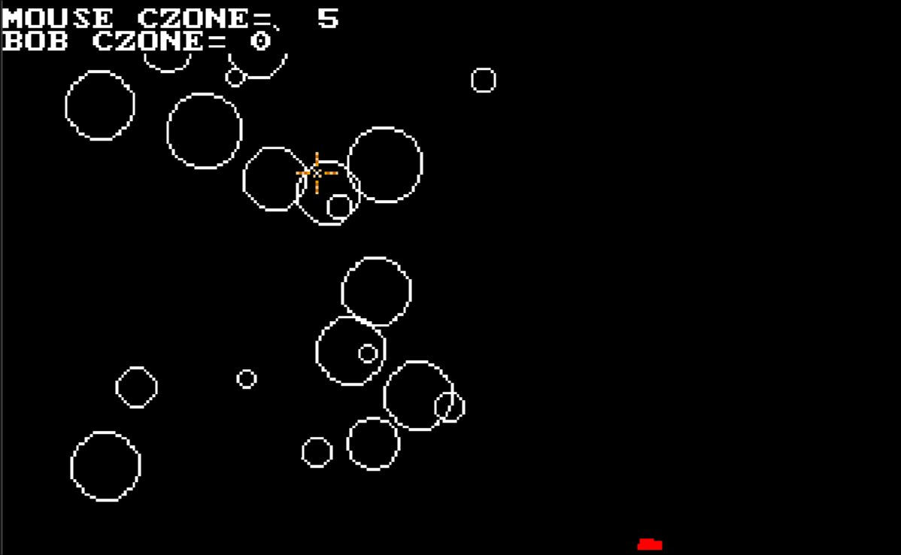

# Circular Zones

Back in 1993 we had some kind of exam to see what sort of sets you'd be in for
your GCSEs, to ultimately see whether you'd be the sort of slave who wears a
shirt and tie or a regular slave. Me being weird and gobby, not paying much
attention in class and getting on with the crayon eaters more than the normal
kids, it was never really clear whether I was a retard or special.

Sometime in year 9 there were these tests to figure it out for once and for all,
and in one test was this trick that I'd never seen before: Pythagoras Theorem.
Apparently, the distance between two pixels is the square root of the distances
times themselves and added together. Or something like that, but to do with some
boring shit about triangles and Greek names.

I realised there and then that you could use it to figure out how far things
are! Magical knowledge that only the kids in the top sets knew, and no teacher
would tell me about an exam question. So smuggled this illicit knowledge out of
the exam, went home and wrote a library for circular collision zones and
buttons.

I didn't find out about sine tables or fast inverse square roots until years
later, or that my maths teacher and Stanley High school in general were beyond
shit. I got moved up a set.

* [⚫ download](czone.amos.zip)

