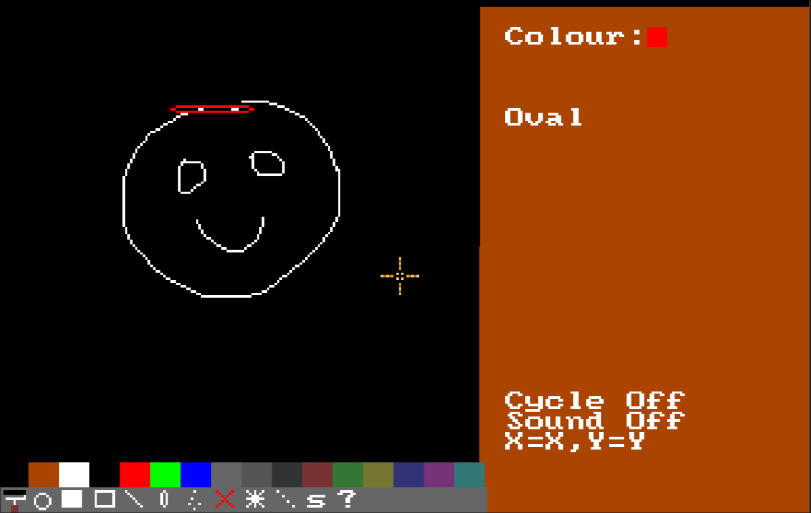

# Draw 'n' draw

It was Ste Keyhoe's amiga that inspired enough envy to make me work for Ogden's
paper shop in the bitter cold, but not spend all my money on sweets. Asking for
money for Christmas and my birthday, and adding a pitiful amount in comparison,
on my 13th birthday I defected from the ZX Spectrum to the Commodore Amiga.

The reason wasn't the games, it was [Deluxe Paint](/log/2005/seascape) - being
able to zoom in and paint those pixels with a mouse, using 64 colours that you
could set yourself.

When Ste lent me his AMOS: The Creator manual and a backup of his floppy disks,
I spent weeks making my own cheap copy of DPaint, containing useless features
that were only useful as a spectacle.

But what a spectacle it was!

* [🖌️ download](draw.amos.zip)

