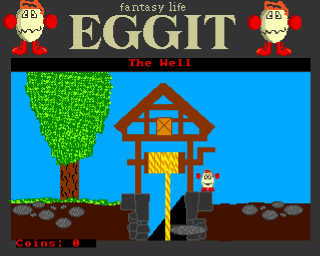

# Eggit

This is my final Amos game, my best one but unfinished due to lack of plot.
Eggit is platform puzzle game in the style of Dizzy, by Codemasters. Its
features include a map, save/load game, custom palettes for each screen,
demo mode, and loads of hidden stuff.

[⏯
](https://youtu.be/pSFFcp6UPvA)

* [🥚 download](eggit.hdf.zip)

Eggit (aka Stephen Edgar) was a friend in school, he pretended to be pissed
off with being portrayed as a sarcastic egg at first but he really liked the
attention, he helped playtest and came up with ideas for the game. Sadly,
Eggit can't be with us today, but he'll be remembered forever.

The game does lack an end, its big enough to end it where it is and the toolset
is there, I just ran out of ideas. If a single person gets past the fires in
the underground caves and past the guard in the castle in the clouds (WITHOUT
CHEATING) then I'll write an ending.

2024 note: This offer has stood unclaimed for 25 years, so I'm retracting it!

I'm well proud of this game because I "invented" loads of stuff, like:

* using the highest plane in the 32 colour screen as solid, 0-15 are background
  colours while 16-31 are stuff you can walk on.
* putting all the input in to a function, then developing it for keyboard/joystick,
  custom keys, and eventually for "demo mode" recording and playback.
* that cool map screen that shrinks (and saves to disk) all the rooms where you've
  already been.
* custom palettes for dark rooms, but all of them are compatible with the original
  one (so you can use your torch to discover stuff). This was inspired by
  [seascape](/log/2005/seascape) by Electronic Arts.
* completely lazy method of loading/making screens - they're saved from Deluxe
  Paint as 32 colour IFFs. Sooo fast! A new screen was pasted together from the
  last in less than five minutes, seriously, a 600 seconds five minutes. The game
  is huge because of this. Maybe it's too big, but I can fill in some of the empty
  bits later on. (spoiler: I didn't)

