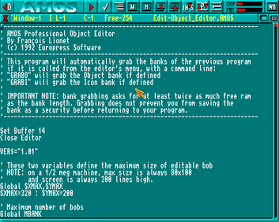

# AMOS BASIC

AMOS was the Amiga port of STOS, a BASIC for the Atari ST written in assembly
language by François Lionet. A procedural programming language and
batteries-included IDE that supported the emerging multimedia pipelines of the
day. Deluxe Paint as a pixel painter and animation tool, an array of audio
editors and trackers, and later on it even supported 3D graphics created by
the likes of Imagine 3D.

Back in 1993 I'd saved up my paper round wages, pooled birthday and Christmas
money, sold my ZX Spectrum and got my hands on an Amiga 500+ and a portable
colour TV. My high school years were defined by playing pirated games shared
around school, while creating my own in AMOS and sharing those too. Not that
anyone wanted to play them - mine were shit.

## Ramblings about multimedia

The 90s were a beautiful time for multimedia. It was the end of an age when
drives were an expensive luxury, low bandwidth, low capacity cassette tapes
were out. Double sided, double density floppy disks ruled the day.

In the good old days graphics and audio were engineered rather than produced. 
You'd carefully craft the palette and paint the pixels. 16 colours looked naff,
64 were painfully slow, and 32 needed some tricks to make things fast enough.
You could swap the colours out in realtime very quickly, by abusing duplicate
values or switch them for animation effects as the electron beamed across the
tube. Compression mattered, bytes were counted, sizes were aligned to hardware
widths. You had to keep ahead of the scan line while streaming into the graphics
card's memory, otherwise you'd get tearing, or you could take the speed and RAM
hit of double-buffering. I once heard the reason why BMP files are upside down
is because a subtraction operation took less cycles than an addition.

It isn't true, but it's believable.

Audio was similar. A floppy disk couldn't even hold a minute of 11khz mono
recorded into your mic, and you'd want a couple of tunes in your game. So
instruments would be crafted by breaking them up into start, loop and end,
shaped by an envelope and pitch shifted on the fly by banging the metal,
interleaved to fake more than 2 channels. The snare drum would take up more
space than everything else combined, because entropy was expensive. Chip tune
was a feat of engineering.

Then the CD came along. Voice acting and full-motion video wow'd the general
public while we looked on in utter disgust. With 800 times as much space, we
went from an era of extreme resource constraints to one of egregious bloat and
wastefulness. From one of precision and craftmanship, to worthless filler. Yet
on the cusp of that change, BASIC programmers like me could churn out hundreds
of screens in [DPaint](/log/2005/seascape) without tiling, and
[make games](eggit) and share them with the kids in school.

The empowerment, the loss of craftmanship and the hypocrisy were all real.

## Some projects

* [🗺️ Ultimate Adventure](ultimate-adventure)
* [⚔️ Mega Battle](mega-battle)
* [🖌️ Draw 'n' draw](draw)
* [⚫ Circular Zones](czone)
* [🔫 Operation Q.A.B.](qab)
* [🔥 Matchstick Man](matchstick-man)
* [🎯 NSLE](nsle)
* [🧨 Bomb City](bomb_city)
* [🔊 Boom! Shake the Workshop](boom)
* [🚀 Thrusts](thrusts)
* [⭕ O's and X's](o-and-x)
* [🐛 Wormy](wormy)
* [🤖 Quatrazon](quatrazon)
* [🛡️ Viking / Saxon Tester](viking-tester)
* [🪐 Space Game](space-game)
* [💣 Minefield](minefield)
* [🥚 Eggit](eggit)
* [✍️ Scrawler](scrawler)
* [🎲 Misc](misc)
