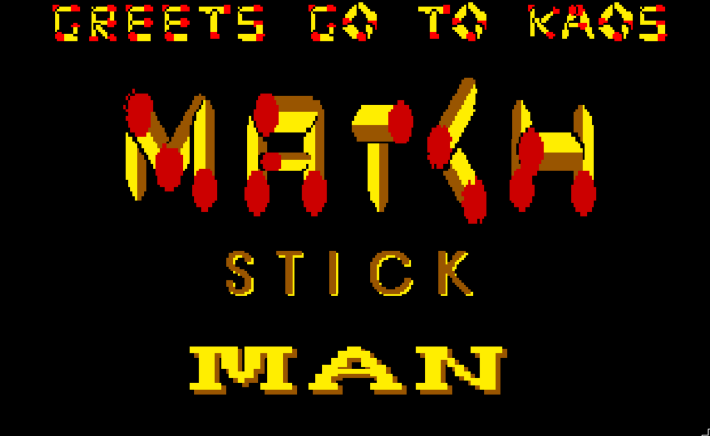

# Matchstick Man

I could try to deny that the skinny red headed protagonist wasn't some attempt
at a self-portrait, but I'd be lying. This was a game I actually finished
making, is somewhat original apart from the stolen music and sound effects.

It's also punishingly hard. Made some time in 1993.

* [🔥 download](matchstick_man.amos.zip)

