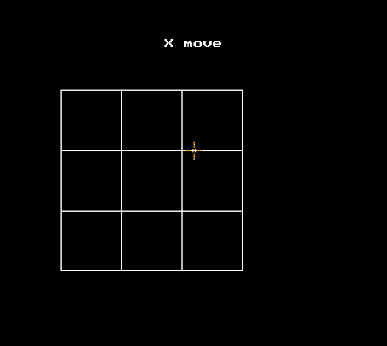

# O's and X's

A noughts and crosses game that is flawed because the computer doesn't expect
you to not fill in the middle square, so you can beat it every time. But it's
2 players too, and I could play with my brother and sister.

An exercise in table-mapping and brute-force, if I remember correctly.

* [⭕ download](o_x.amos.zip)
