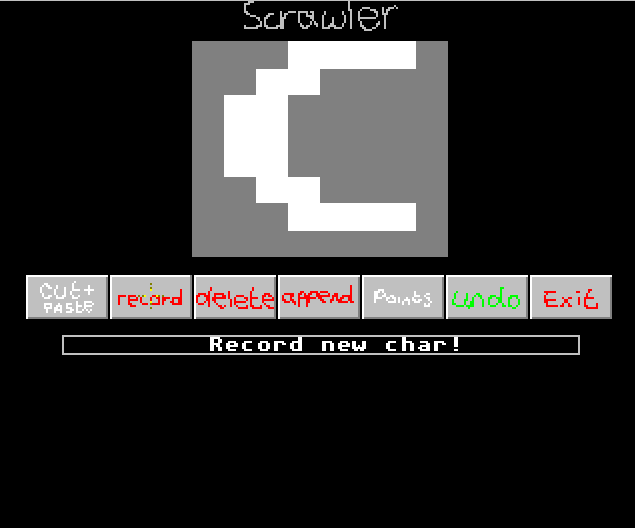

# Scrawler

There was a game on the Amiga, Jimmy White's Whirlwind Snooker, and along with
being a really well engineered treat, the title screen had this cool effect
where the [title text was written out](https://youtu.be/5Pr3IsnqxGs) like chalk
on a board.

Well, I wanted that effect, so I made a recorder for mouse strokes. Worked out
pretty well, though didn't age very well because the Amiga and MS-DOS had fixed
clock speeds.

Here's an example of the editor in action:

click for video

Download:

[amos](scrawler_amos_src.zip) |
[amiga emulator](scrawler_runpack.zip) |
[ms-dos](scrawler_dos.zip) |
[visual basic](scrawler_vb.zip

