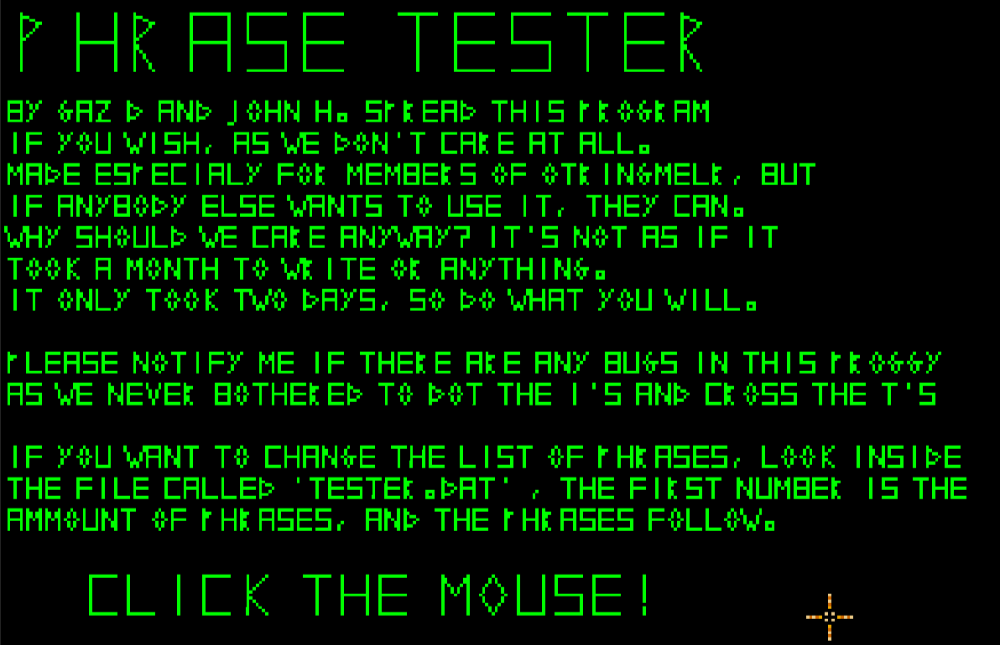

# 🛡️ Viking / Saxon Tester

John, Graeme (and Craig for a bit) were members of
[Regia Anglorum](https://regia.org/), a mediaeval reenactment society where
we cosplayed as viking peasants. We made our own authentic, ill-fitting
tunics and trousers from itchy woolen blankets, "Cornish Pastie" shoes out of
leather, and spent every other weekend beating the shit out of each other
with blunted spears and scramseaxes.

Occasionally we'd do public displays and had to memorize basic Old Norse words
to do with battle, this educational tool was an effort by John and I to memorize
as much of it as we could. In hindsight, the only thing I remember is
phalanx-esque march of "TROTHA... OI!"

* [🛡️ download](viking_tester.amos.zip)
