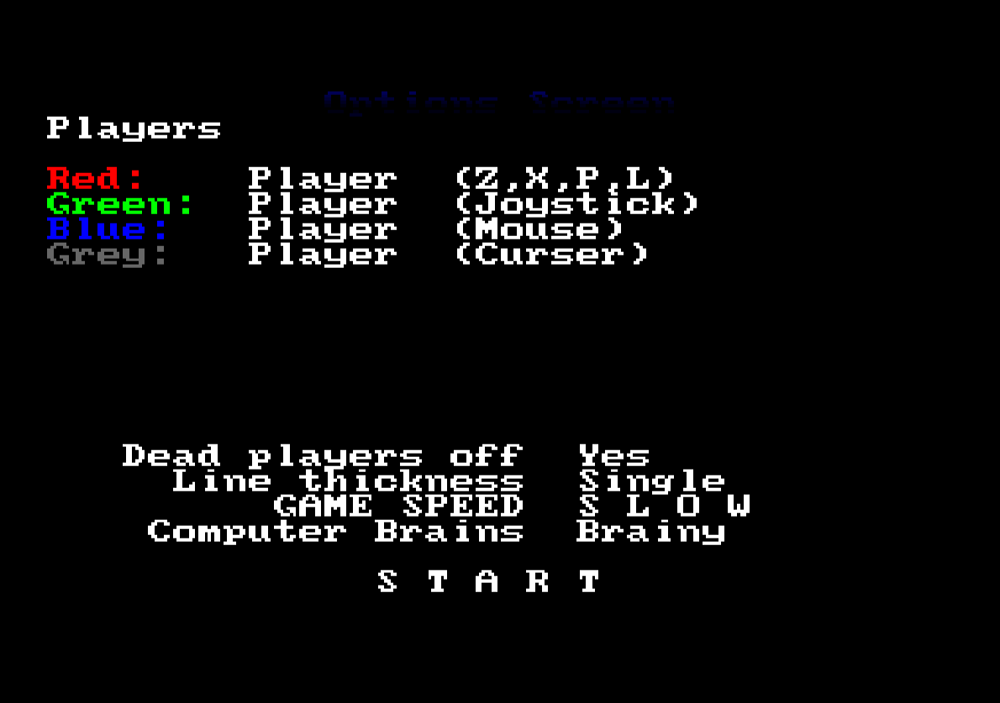

# Worms

Everyone likes a snake game. My first one was called worms. The AI was terrible,
and didn't really work. But it was made for 4 players hunched over the same
portable TV, so that didn't really matter. The fast version is unplayable due to
it not having any pauses. And it's unplayable because amos-ts doesn't do
multiplayer anyway and modern keyboards don't like you pressing 8 buttons at
once.

* [🐛 download](worms.amos.zip)

