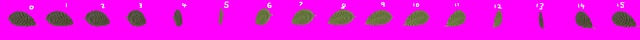
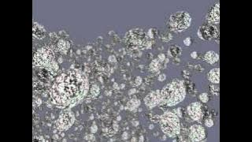
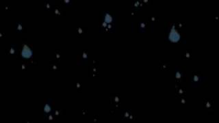
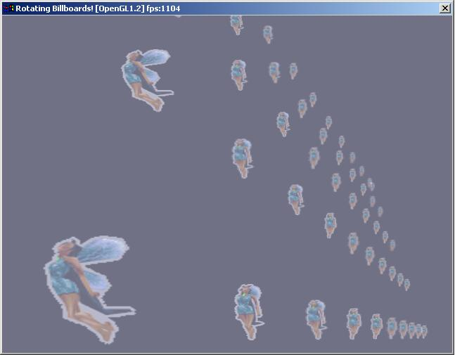

# Axis Aligned Billboards

"Mariokart billboards" are a specific type of axis aligned billboards which
represent fake 3D objects, the kind of 2.5D that Mariokart on the Super
Nintendo used with its Mode 7 trickery.

The idea is that you take a texture like this leaf:

And the billboards show a different angle depending on the angle of view.

Useless with today's hardware you say? Not so! The technique allows you
to render tens or hundreds of thousands of particles as a huge cloud of debris
which looks 3D from a distance, giving cool explosions which work on even
the most modest hardware:

[⏯
](https://youtu.be/cPtzMCbLP9Y)

Or flip the axis 90 degrees for cartoon rain:

[⏯
](https://youtu.be/tUKlUV6JZ4o)

Or just have oldskool sprites that animate as well as rotate:

Get the code for particle systems, billboards and the generator tool
[here](https://sourceforge.net/p/irrext/code/HEAD/tree/trunk/extensions/scene/ISceneNode/RotatingBillboards/)
