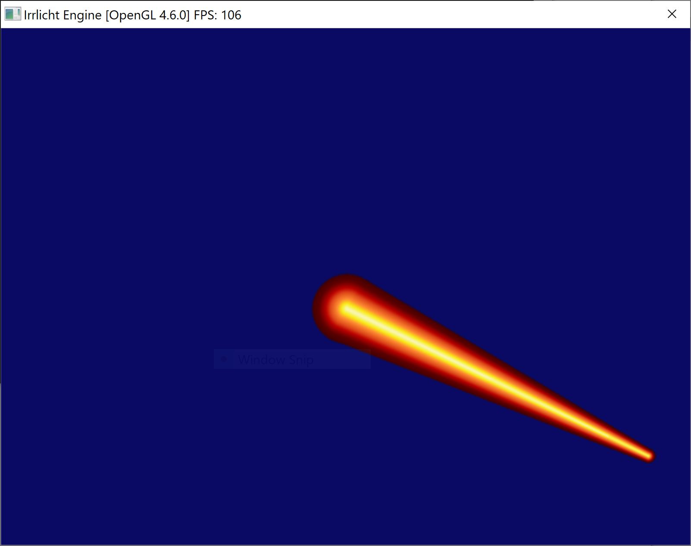

# CBeamSceneNode.cpp

Made for Irrlicht in 2009. Download [here](CBeamSceneNode.zip)

Click for a video:

## Doc

Author: Gaz Davidson
License: Irrlicht engine license
Date: 13th Feb 2009
Irrlicht version: 1.6

This beam node is simply two billboards with a quad between them. 
The edges of the beam are rotated around the centre by the same amount as the line in screen coordinates.
Requires SViewFrustum::clipLine which is part of Irrlicht 1.6.
Use setPosition(start, end), the start becomes the node's position.

todo:
 * Fix size of bounding box to include beam size
 * Order billboard drawing so the back is always first
 * Don't draw beam when viewed from the edge
 * fix a bug with the beam flipping (back facing) at some angles
 * Implement clone() method and test serialization
 * add a dummy node if created in an editor, so users can easily move the end point in irrEdit