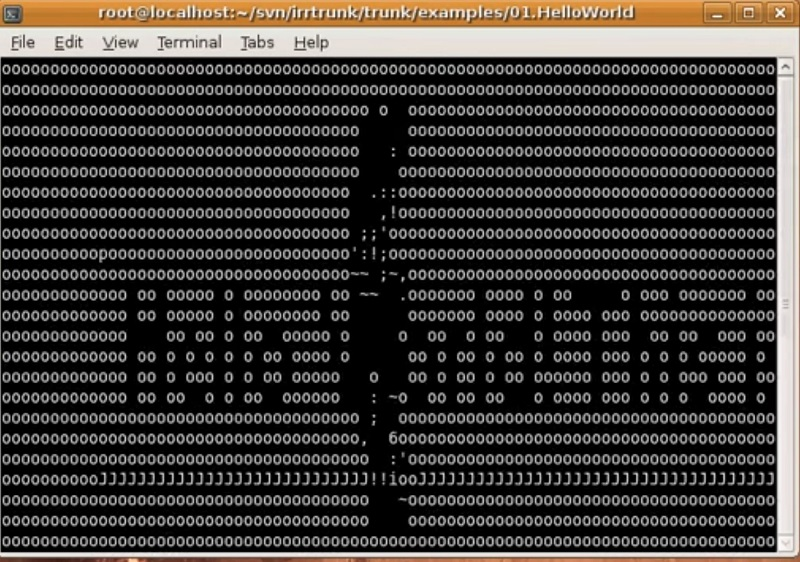

# Irrlicht Console Device

Someone on the forums wanted a way to load Irrlicht without a GUI so they could
use Irrlicht's software renderer to render images onto 3D objects, like mugs
and other products.

So, since it sounded like fun, I went the distance and make a console driver
that treats the console like a window, and if you render to it then it outputs
your 3D graphics as ASCII art. It's no libcaca, but I thought it was pretty
cool at the time, and I had a lot of fun with it.

> (click for video)

Here's [another video](https://youtu.be/JD0eNN4F6P4) that ended up trending
a decade later in some kind of Spanish cursed video meme or something!
