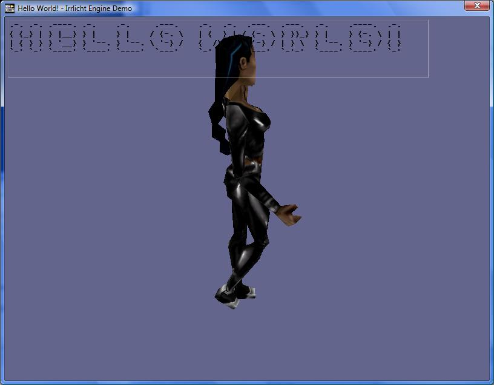
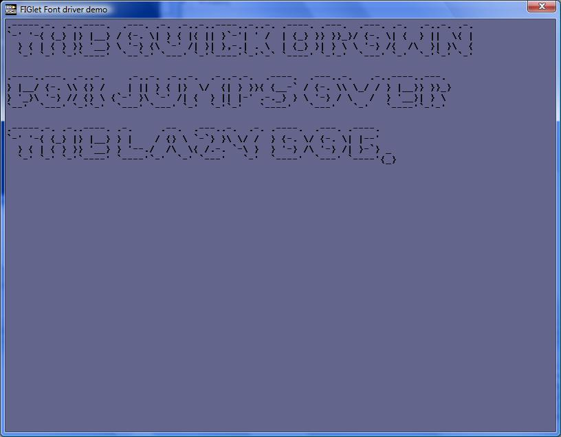
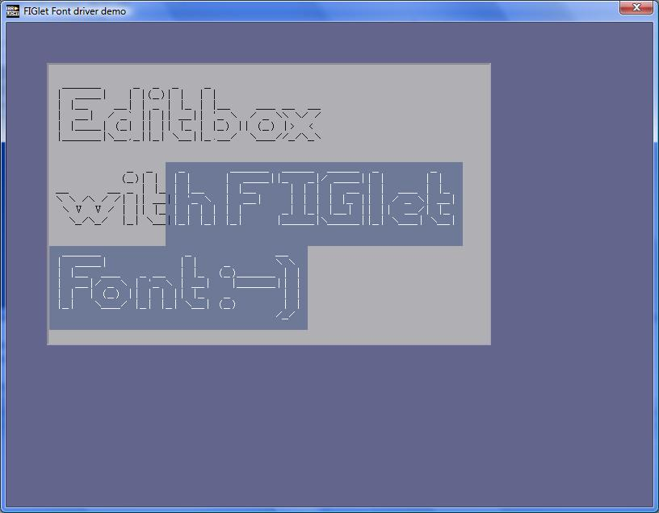

# 🔤 FIGlet Driver

* [🐱 github](https://github.com/bitplane/irrlicht-figdriver)
* [🔗 announcement](https://irrlicht.sourceforge.io/forum/viewtopic.php?p=198620)

If you're going to have a [console device](../console-device) then it makes
sense to also have decent console fonts. So I wrote a figlet driver.

Here's some pics:

