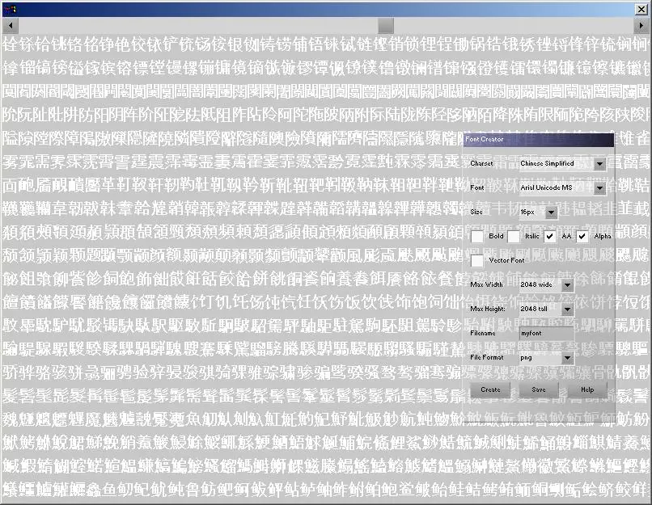
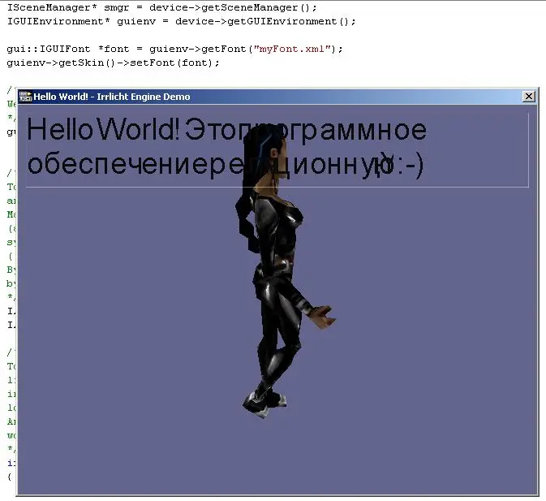

# Font Generator

Irrlicht’s new font tool is my attempt to solve the problems with the old font
system. It only supported ASCII characters, couldn’t span more than one
texture, was Windows only and could only be compiled with a commercial
Microsoft compiler with a resource compiler, it didn’t support antialiasing
either.

The new font tool writes XML files and uses Irrlicht for rendering. Although
it was first Windows only, it was modular and a Linux generator was later
donated by Neil Burlock, it does not yet support OSX/Cocoa font generation.
Because the new fonts are based on sprite banks, it should be possible to
remove characters and reorder them in future, even supporting animated letters
if you’re into that sort of thing!

I also made a tessellator for vector fonts, but it used the brute force and
ignorance method and is forever incomplete; it saved but lacked a loader. The
purpose of these was to convert vector or bitmap fonts into mesh buffers so they
could be rendered in the 3D scene. Or extruded, rotated, apply shaders to them
and so on, on devices that lacked font loading libraries (Irrlicht has some
serious "not invented here" going on that makes it perfect for supporting
oddball platforms)

The font tool has been part of the Irrlicht distribution for a long time now,
you can get it along with the source from the
[project website](https://irrlicht.sf.net/).
