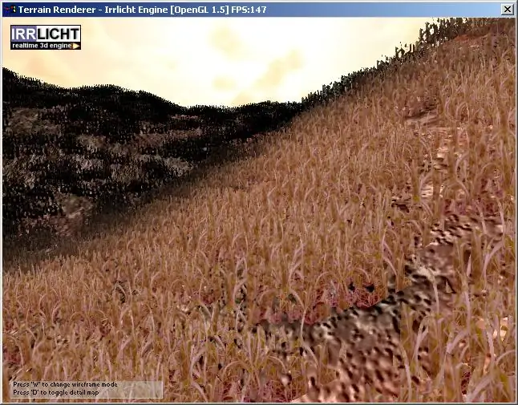
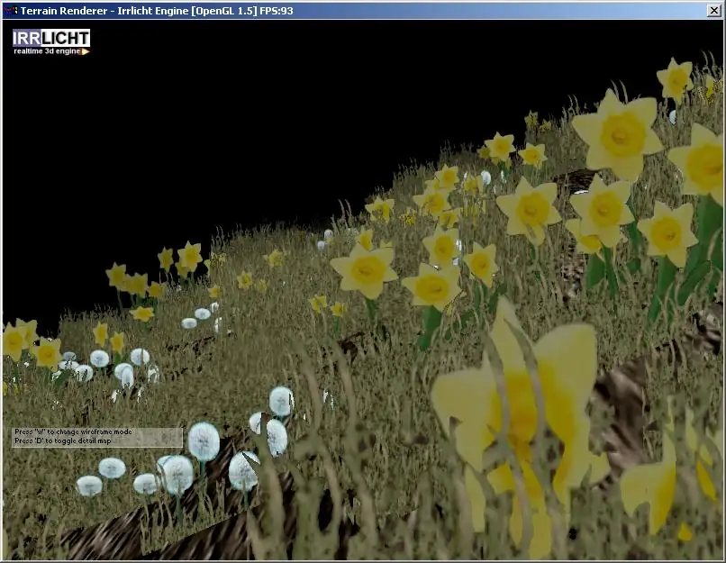
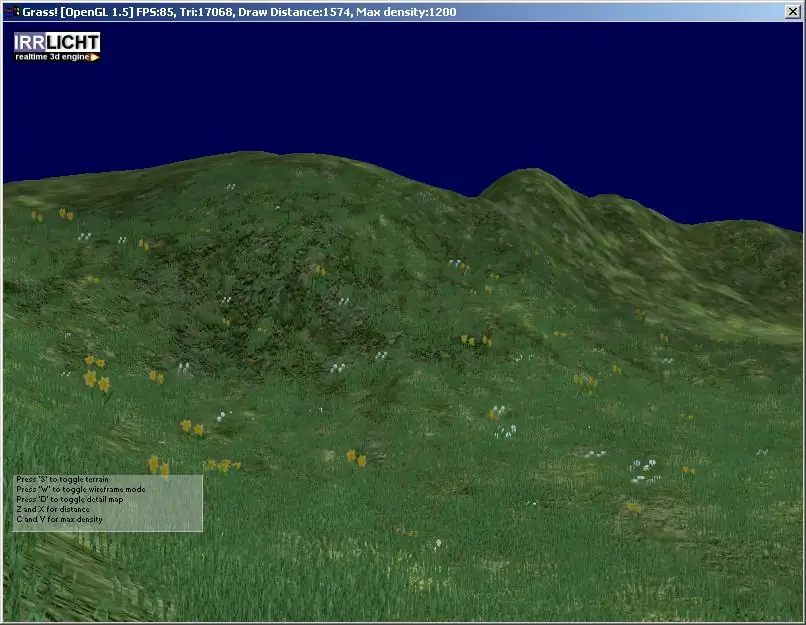
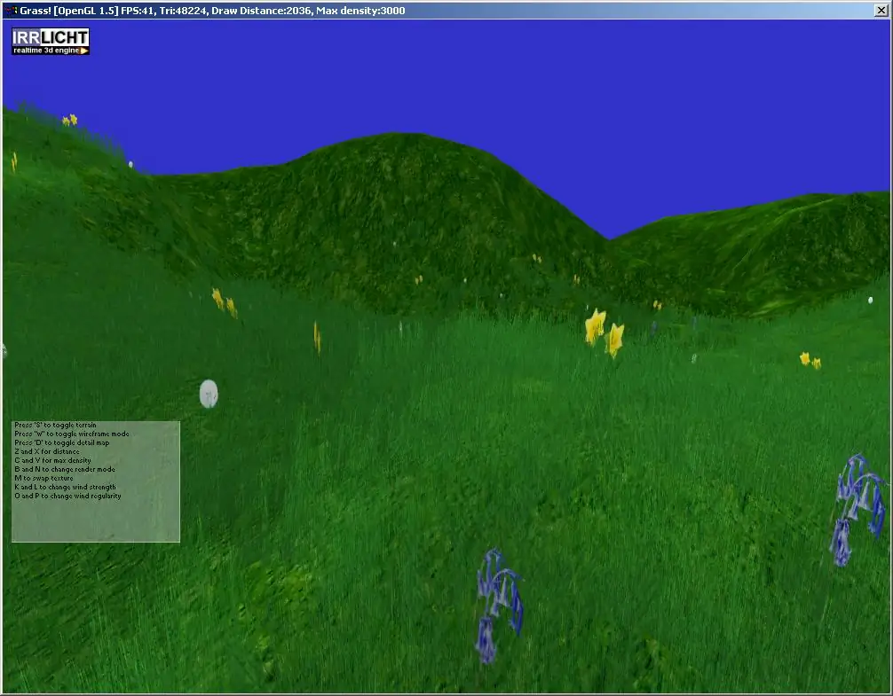
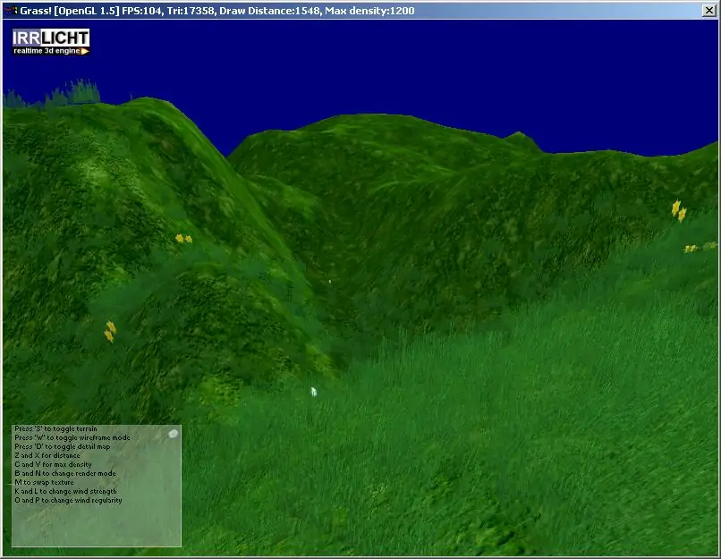
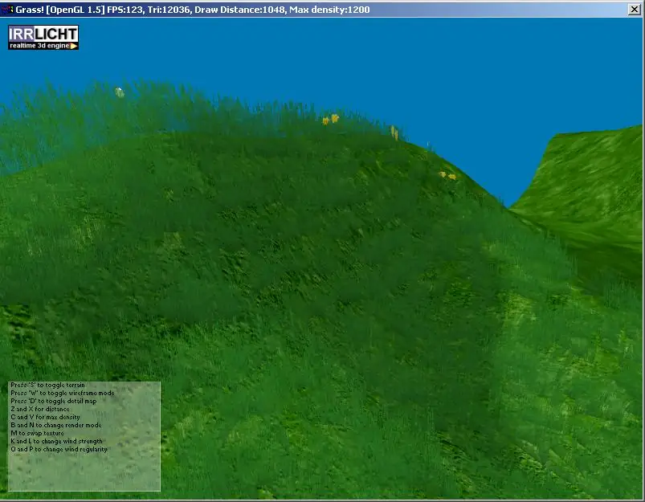
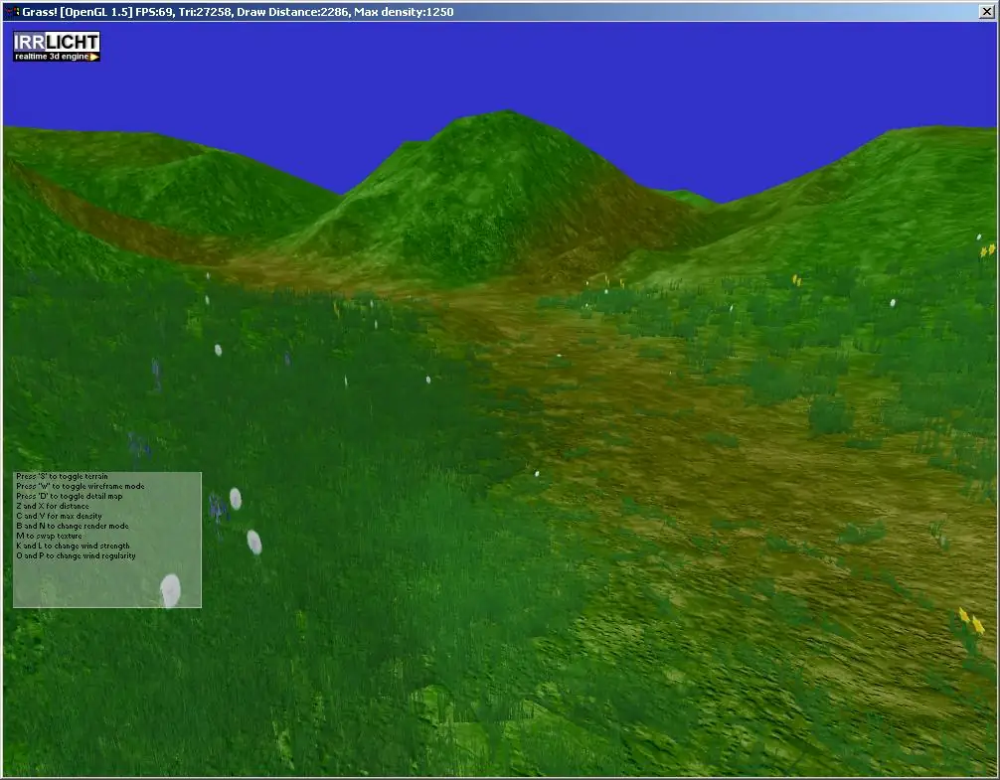
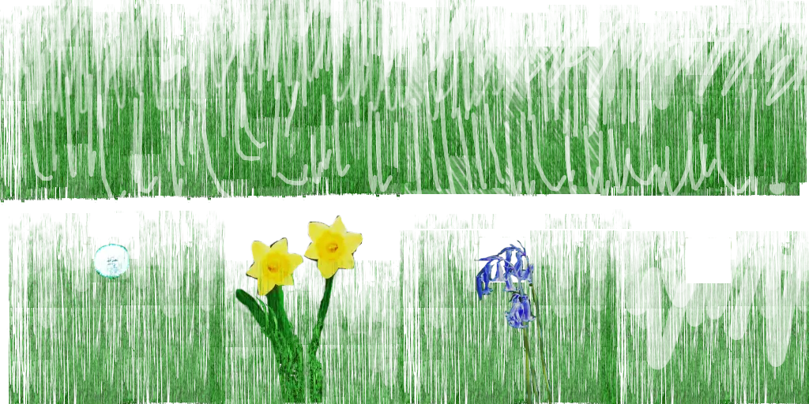

# Grass

This grass patch scene node for Irrlicht is a simple way to add foliage to the
built-in geomipmap terrain scene node. It works by dynamically adding blades as
you approach and removing them as you retreat from a tile. The approach is fixed
function, meaning it will work on very old machines and mobile platforms where
geometry shaders are not supported. The magic is entirely in the performance
options, you can configure it to spend minimal time rendering a patch, set draw
distance and refresh rate according to the specs of your user’s machine. The
wind is accomplished using Perlin noise, thanks to
[Asger Feldthaus](https://web.archive.org/web/20161020072617/http://www.wc3jass.com/asger).

I’m pretty proud of this node, it’s been featured in a few indie games including
an online RPG. You can get the latest source from the irrExt svn repository
along with the docs, or download a [Windows demo](grass.zip) for your viewing
pleasure.

## Piccies

Some pics of dev progress:

|  |  |
|  |  |
|  |  |
|  |  |

and here's the image it uses for the sprites:

