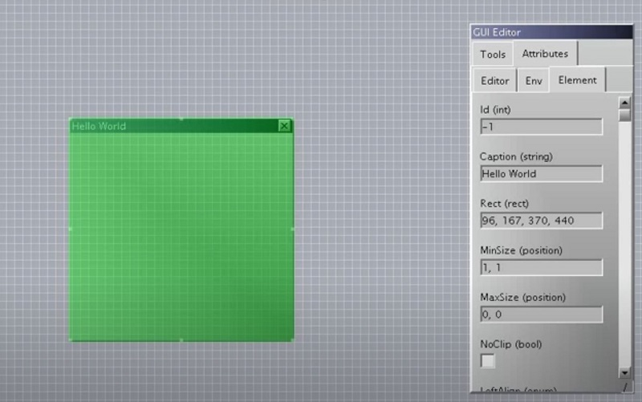
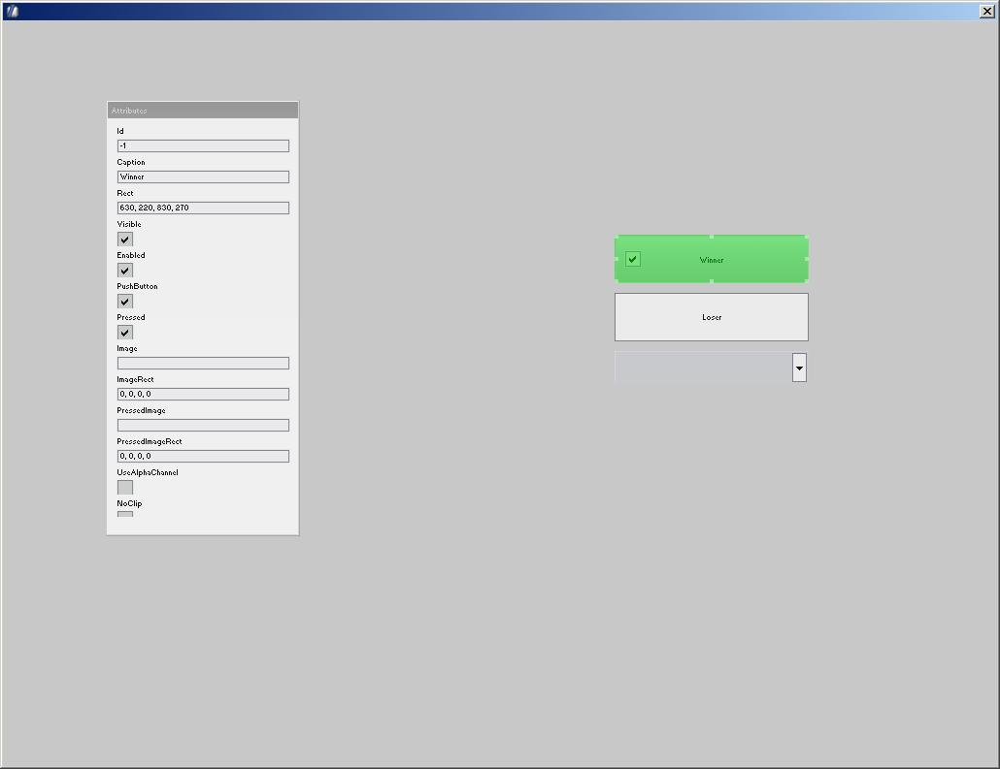
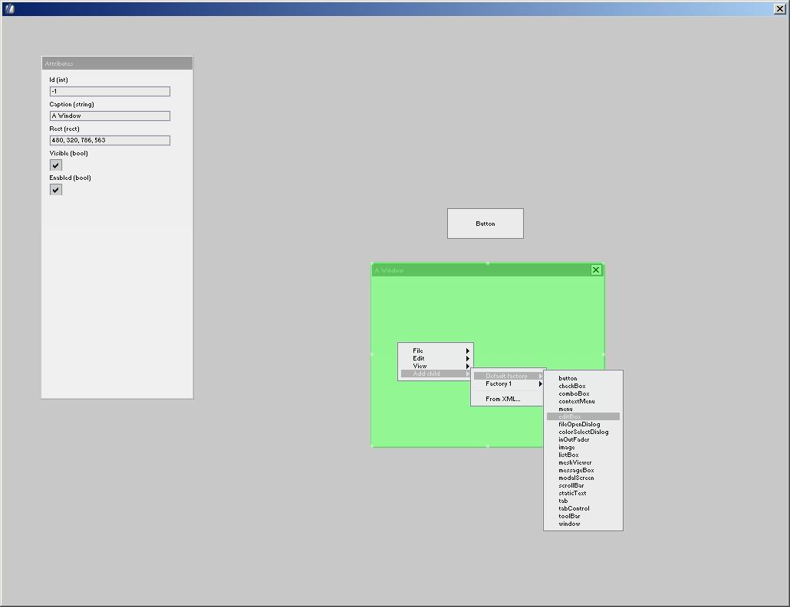
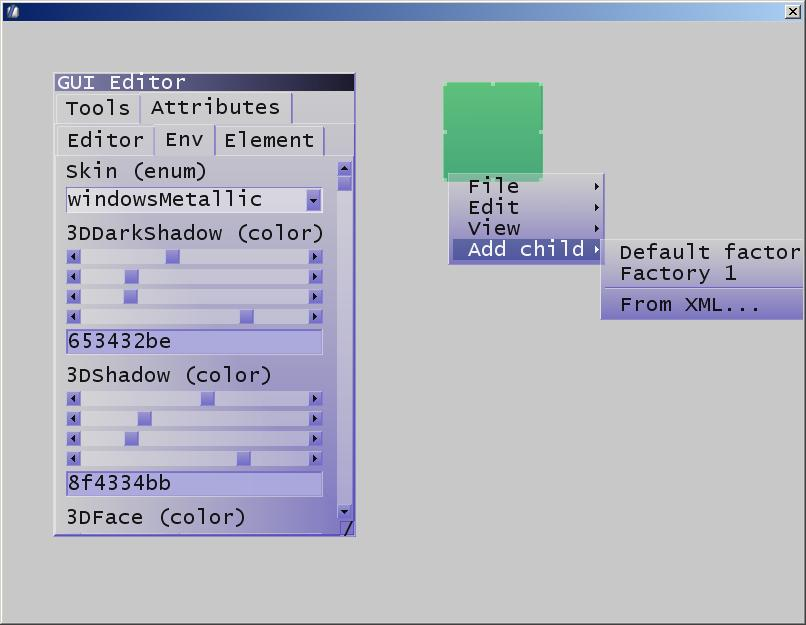
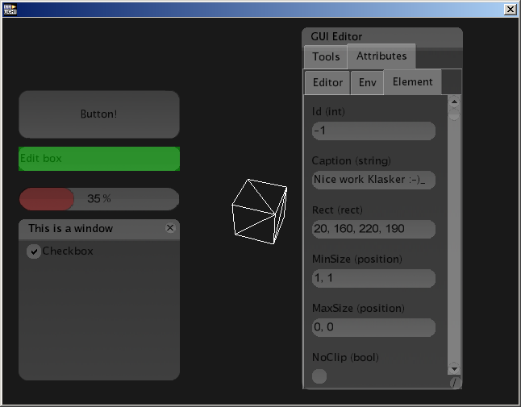

# Irrlicht GUI

I wrote the GUI editor that comes with the Irrlicht Engine, along with the
serialization that allows it to happen, the skinning tools, plugin system,
a cross platform version of the bitmap font generator, and many of the more
awkward features in the basic UI widgets (like clipboard, keyboard shortcuts,
tab ordering, proper cursor and highlighting support, advanced features in
combo boxes and so on). Basically my time spent in Visual Basic made me quite
opinionated about what a decent GUI should look like and what features it
should have, and they aligned with Niko's too so he let me go wild with that
area of the project.

Here's a video of the GUI editor, the rest you can see in most games that use
Irrlicht as a graphics engine.

[⏯
](https://youtu.be/jLzZuTiPqpk)

Klasker made a nice skinning tool for it. I think the skin in the bottom right
was by fuzzysp00n, but don't quote me on that:

|   |        |
|   |  |

