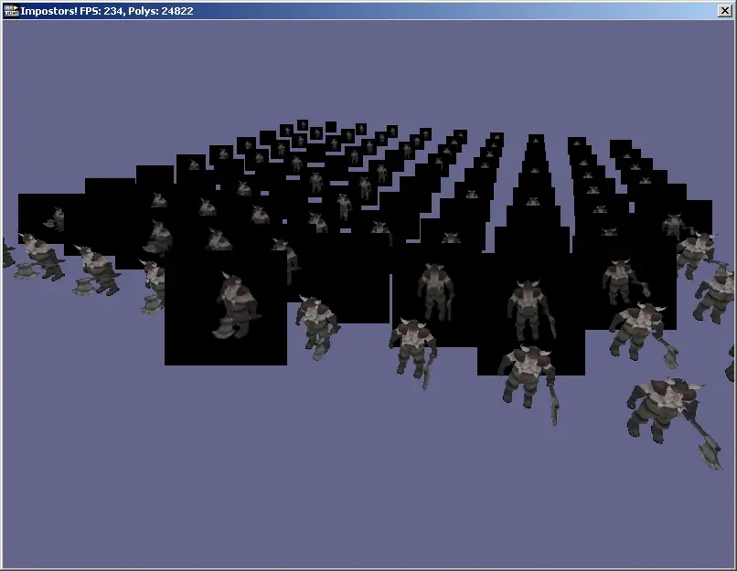
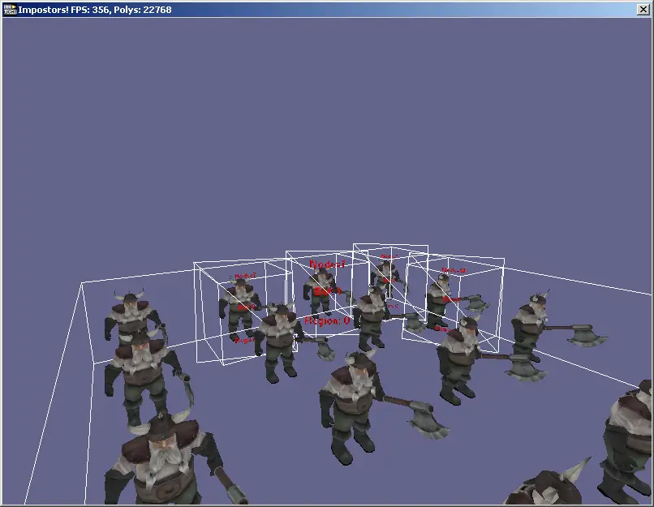
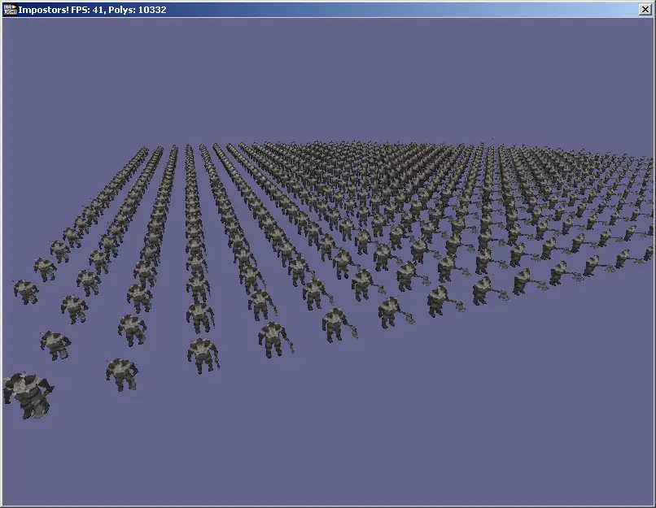
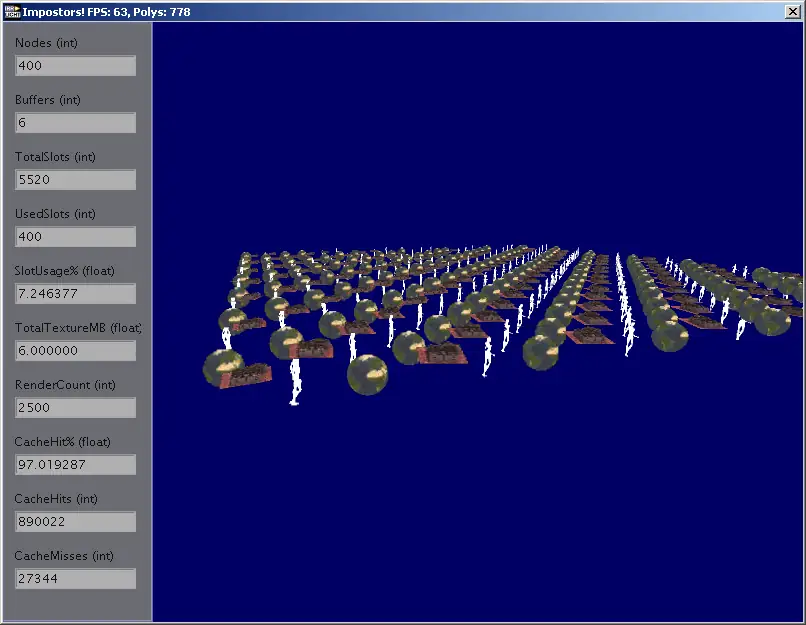

# 🖼️ Impostors in Irrlicht

* [⏯ video](https://www.youtube.com/watch?v=cHAfqwagk7I)
* TODO: source code is on an old hard drive

## Concept

Impostors are a simple 2D replacement for a complex 3D model, the idea is to
vastly reduce the number of polygons rendered. Impostors are the lowest
level of detail (LOD) of geometry in the scene and are swapped for a real
model when the model reaches a certain size in the distance. The idea is to
render the object into a texture, then draw this texture as a billboard in
the scene.

## The Problems

As I discovered during my prototype, making a convincing impostor system is
a Hard Problem.

### Texture Management

The first part of this hard problem is managing textures. We need to draw as
many billboards as possible in as few calls as possible, so render targets
must be divided into slots to hold the images, then the entire batch be drawn
together. For ease of management it makes sense to have at least one render
target for each size of slot, from the minimum to the maximum. New targets
need to be dynamically allocated during runtime and periodically tidied to
release memory.

Mipmaps also pose a problem, without mipmaps the impostors will look
pixelated, yet with them the borders will become wider as the mip-level
increases and the impostors will blend into each other. Regenerating mipmaps
for the entire texture will cause performance issues. The best way around this
is to render to a first texture, copy this to its location, then scale it into
the next mipmap in the appropriate position and ignore all other mipmap levels,
though this requires a 1 pixel border around the impostors at the lowest level.
Access to mipmap levels is not yet supported by Irrlicht and so will need to be
be hacked in. The easiest way is to just not support mipmaps and to re-render
when the size changes.

Because transparent objects must be rendered quickly, from far to near in
non-overlapping batches, it would make sense to have special textures for
transparent objects to keep the draw calls to a minimum.

## Impostor Generation

### What to generate

The first thing we should do is think about ignoring objects that are
inappropriate, for example it makes no sense to make impostors of lights.
Billboards may be worthwhile if there are a batch of hundreds of them, particle
systems may if they move very slowly, it may make sense to process some custom
nodes but not others.

For an object to be replaced it must be visible and not be culled by any of the
usual automatic culling methods including ones which haven't been invented yet.
The size of the object on screen must not be smaller than the minimum texture
slot size or larger than the maximum, the screen size could be worked out by
transforming the object's bounding box points, adding them to a camera-space
box and scaling the closest wall using the FoV and aspect ratio of the camera.

### When to generate it

The images cannot be regenerated every frame or not only do they provide no
optimisation they will actually impact performance. Several expensive operations
must be done to generate an impostor, we must switch render targets, draw the
impostor to the target, switch back to the main target, then finally draw the
impostor in the scene. So to actually make the impostors technique worthwhile
we should only regenerate under certain conditions:

1. If there is no impostor image present then we have to generate one.
2. If the impostor is now closer, we'll have to render a larger image.
3. If the angle between the camera and object have changed it will look wrong
   and must be regenerated before the user notices.
4. If the node has animated then the image will be out of date, and must be
   regenerated.

### Queuing

Generating too many impostors at once can also cause a huge performance
impact, a large camera movement could cause everything to need an update
resulting in an unacceptable delay. Drawing a massively complex scene without
impostors would cause a similar delay, while drawing stale impostors would
break the illusion. So we need some limit on the a maximum amount of time
spent rendering new impostors, we need to sort the important objects from the
problematic and irrelevant ones which might need to be skipped.

To deal with a queue like this we give each item a priority value produced by
a weighting algorithm, then sort the queue by this value and process as many
items as possible in the allotted time. Here's all the variables I can think
of for now-

1. The size of the object on screen, the larger the object the more important
   it is.
2. The amount of change in angle and distance, more change means higher
   priority.
3. The number of polygons in the model. Punish complex meshes when the queue
   is long.
4. The amount of time since the last generate, punishing those who were
   recently generated. Maybe also punish fast moving and constantly animating
   objects when the queue is long.
5. If the object has never been generated then it is extremely important.

### Generation

Generating an impostor texture is simply a matter of pointing the camera at
an object and then rendering it, however, there is the problem of perspective
distortion. A spherical object is only represented as a circle when it's in
the centre of the screen, towards the edges it becomes more like an ellipse and
the parts off the screen become something much more messy. So if we point the
camera directly at the object, then swap this object for a billboard of the
same size the user will see an obvious and ugly change. If on the other hand we
instead adjust the perspective of the camera, we'll not only have to regenerate
the object much more often, but when generating an object which leaves the
screen we'll cause perspective distortion which bends the object out of shape
and ruins the effect. I'm guessing that the best option here is to just point
at the object and shoot, then fade the slightly distorted billboard in over the
top of the actual object before replacing it. Other options are keeping the
impostor texture slots small and using low detail meshes for the first few
levels of detail, and fading the impostors in to deal with popping.

When rendering the node we need to first ask the texture manager to prepare a
texture slot for this node and camera, move the node in question to a new
scene manager, register the node, draw the scene and then put the node back in
the old scene manager in an invisible state. Changing the scene manager is
done in addChild, so calling ISceneNode::setParent will suffice.

Rendering only the diffuse texture isn't ideal, it would also be nice to render
a depth and normal map for occlusion, intersecting objects and realistic
lighting. However, this means either a maximum number of lights across the
entire set of impostors, or drawing them one at a time. It also means needing
shader-based materials and twice as long spent generating impostors.

## Drawing Billboards

Drawing the impostors consists building the batches of geometry, then looping
through each one, setting the material and rendering the billboards to the main
viewport. Sounds simple enough!

### Batching the geometry

Each batch of geometry comes from the same texture, each texture contains a
certain size of impostor, we need to draw the solid batches first. We should
consider impostor occlusion and its effect on fill rate. It's overkill to work
out which billboards are occluded by other objects in the scene and cull those,
but it should be possible to discard individual fragments by simply selecting a
sensible order for the solid batches and the billboards within them.

The size of an impostor's texture slot is a good representation of its size on
screen, although it says nothing about its distance from the camera. Starting
with a list of visible solid impostors for each texture and then sorting them
by distance from the camera, we can put the closest billboards at the start of
each buffer, draw the buffers with largest textures and nearest average
position first to maximize occlusion. Where there's two textures with the same
sized slots, the texture manager should try to put distant objects into one
and near ones into the other.

Transparent objects are a bit more tricky. They must be drawn in the
transparent render pass strictly from far to near, and as impostors need to be
mixed with transparent objects in the scene they can't be batched. In order to
let the scene manager deal with these we'll have to put them into the scene as
billboard nodes with texture transformations. So transparent impostors take a
different path entirely.

### Building the geometry

Each billboard consists of four positions, texture coordinates, normals and
colours. The positions and texture coordinates are decided at generation time
when the image of the object is captured, the normals are also static. This
leaves us with the problem of lighting.

## Unsolved problems

### The materials

Deciding the most appropriate materials for the most realistic rendering is a
problem I didn't solve

### Popping

Fixing popping by having them fade rather than snap into into position.

### Light management

Irrlicht's light manager has a per-node callback which will allow us to save
the lights for each node... I didn't solve the 'nearby lights per object'
problem in my prototype.

#### Shadows

There's different shadow models, so the way that lighting works with shadows
would need consideration - and you'll need a strategy for each shadow
strategy.

## Conclusion

A really cool project that I enjoyed a lot, but still a lot to do to turn it
into a generic system that works in all cases. Usable, but you'll need to
tweak it for your own use-cases.
