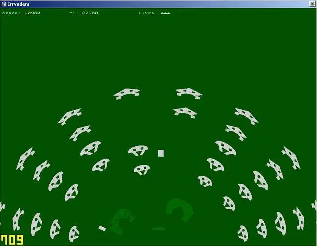
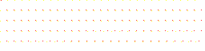
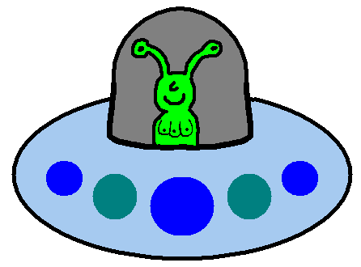
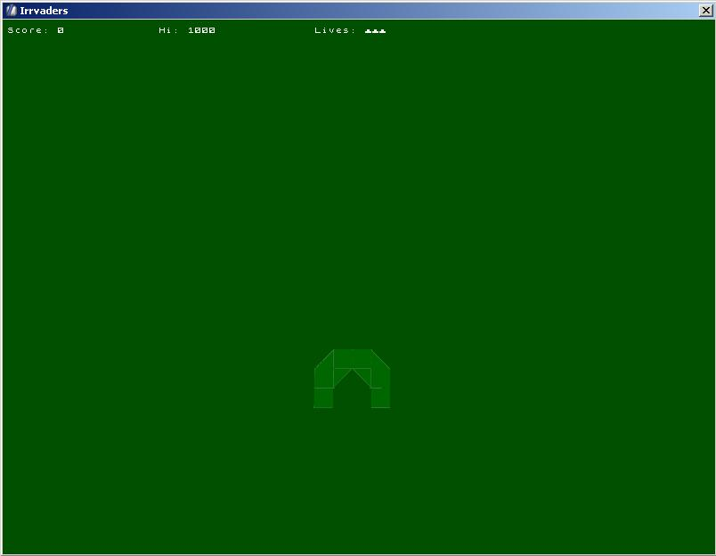
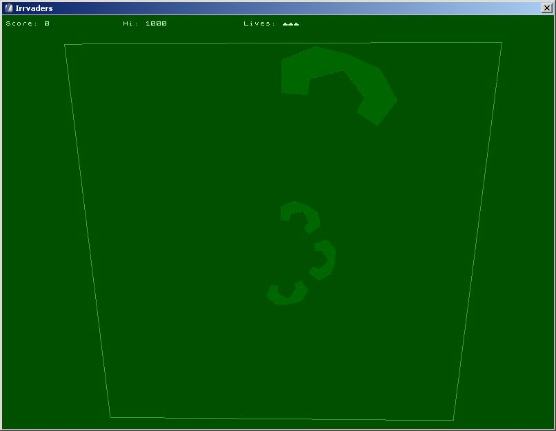
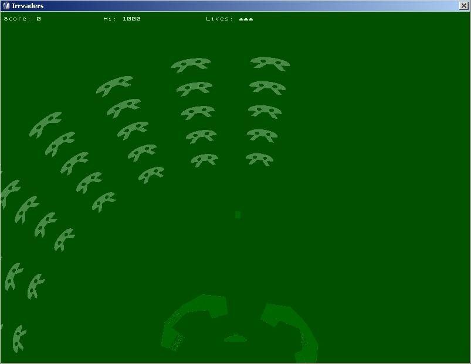

# Space Irrvaders

A while ago we had a "make a Space Invaders clone in a weekend" challenge on
the
[Irrlicht forums](https://irrlicht.sourceforge.io/forum/viewtopic.php?t=17992).
Having written lots of arcade games over the years I decided to try something
different: an Invaders clone with a cylindrical coordinate system, mapped onto
a circle.

The result was a fun game:

> (click for video)

As usual it contains no sounds, also due to its hurried nature the menu design
is pretty awful. Maybe I should add sounds and get it added to Linux distros,
and make the source code something to be proud of, but no promises here!

You can grab a [Windows binary](irrvaders.zip) if you just want to play it,
which will be a lot more fun that reading the source.

## Sprites

It's always fun to make sprites for this sort of thing.

The bases are made out of a triangle and a square, with 4 levels of strength,
and power-ups come in 16 flavors:

| 2x4 grid                  | 4x4 grid                  |
|---------------------------|---------------------------|
|          |   |

The invaders themselves have two animation frames, with two types of alien,
and when you get a power-down that makes them tougher, they get swapped out
for the "beefcake mode" version:

| Eats space dust           | Eats protien powder       |
|---------------------------|---------------------------|
|   |  |

The font is a bitmap tribute to the ZX Spectrum, and has the lives sprite as
one of the characters:

Which looks pretty neat in-game:

### Easter chestnuts

And if you look closely, the UFO has a 3 breasted alien inside. Not that you
can tell from the scaled down version, but we had a laugh about it on IRC:

## Making of Pics

|           |          |
|----------------------|---------------------|
|           |          |
