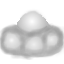
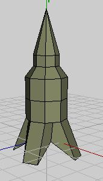
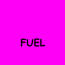
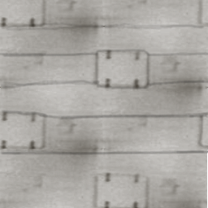

# JetPac

A tribute to the excellent game from the ZX Spectrum, made over a weekend just
for the fun of it.

> click for video

## Download

* [Windows](Jetpac.zip)
* [Mac](Jetpac_OSX.zip)

[bonus progress video](https://youtu.be/OeHRQKSY2A4)

## Sprites

The sprites for enemies and jetman are grey so I can paint them in garish
1980s vertex colours, which I only do for the enemies:

|       |       |         |      |          |
|  |  |  |  |  |

The rocket was made in Wings3D, as were the bonus objects:

And the fuel and rocket base texture made in Gimp, the fuel is an unwrapped
box.

|  |  | 

The font has the same trick as [irrvaders](../irrvaders), made with the font
tool then edited so there's a picture for the lives icon. As it was the new
font tool, it has antialiasing and doesn't require marker pixels, so I deleted
all the bits that aren't used, to save space. But it needs to be a power of two
in each dimension for efficiency reasons. I probably should have removed the
alpha channel to save a few more bytes though:

The rest of the graphics are particle systems and a bunch of box meshes,
textureless using the ZX Spectrum colours to give it that retro feel. The
lasers are just boxes that extend across the screen, two of them to give the
illusion of wrapping.

