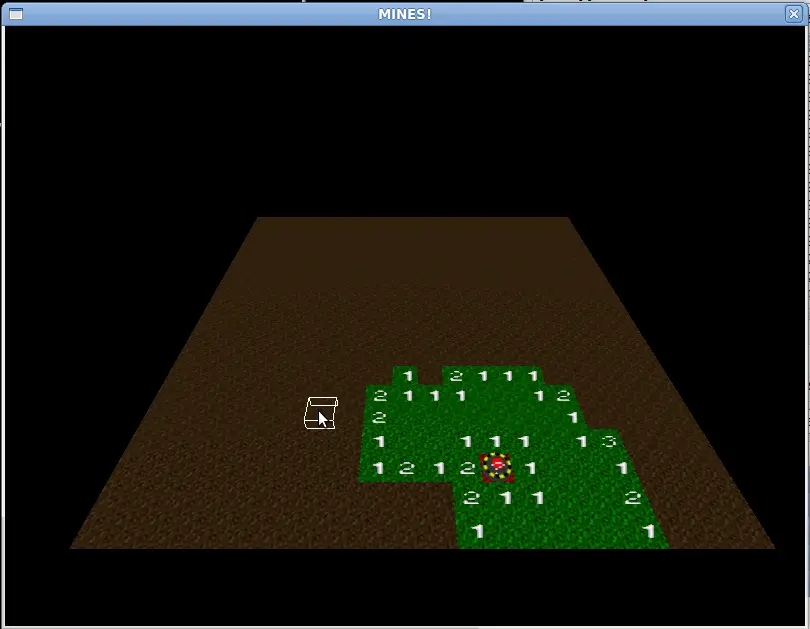

# Mines

The challenge was my idea and only three people could spare the time, the
rules were simple and the deadline incredibly tight: make a Minesweeper
clone in under five hours. This is the one I made:

The five hours included creating all graphics, writing the code and testing
it too, so don’t expect polished graphics, sounds, fancy menus or anything
like that!

You can snag the binary and source [here](mines.zip)
