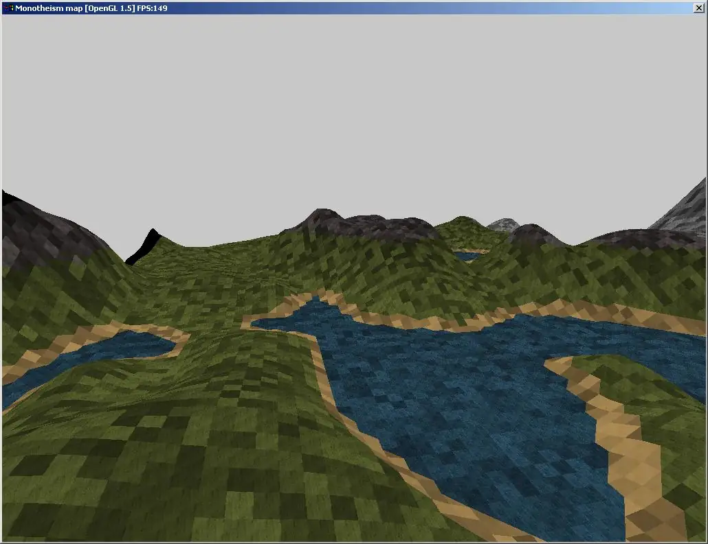
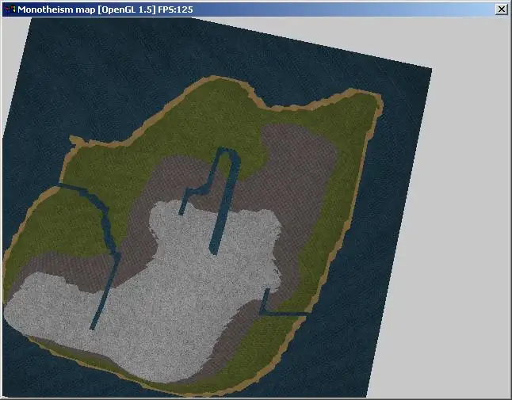
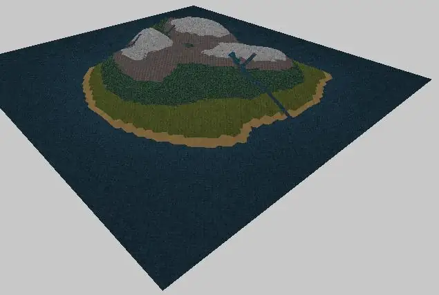
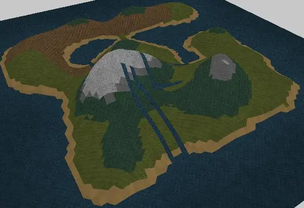
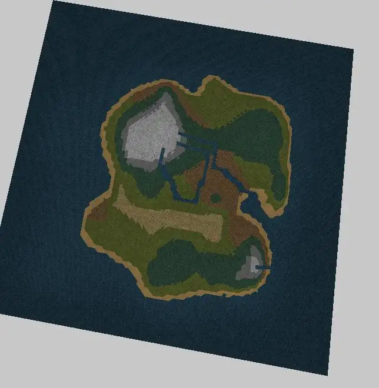
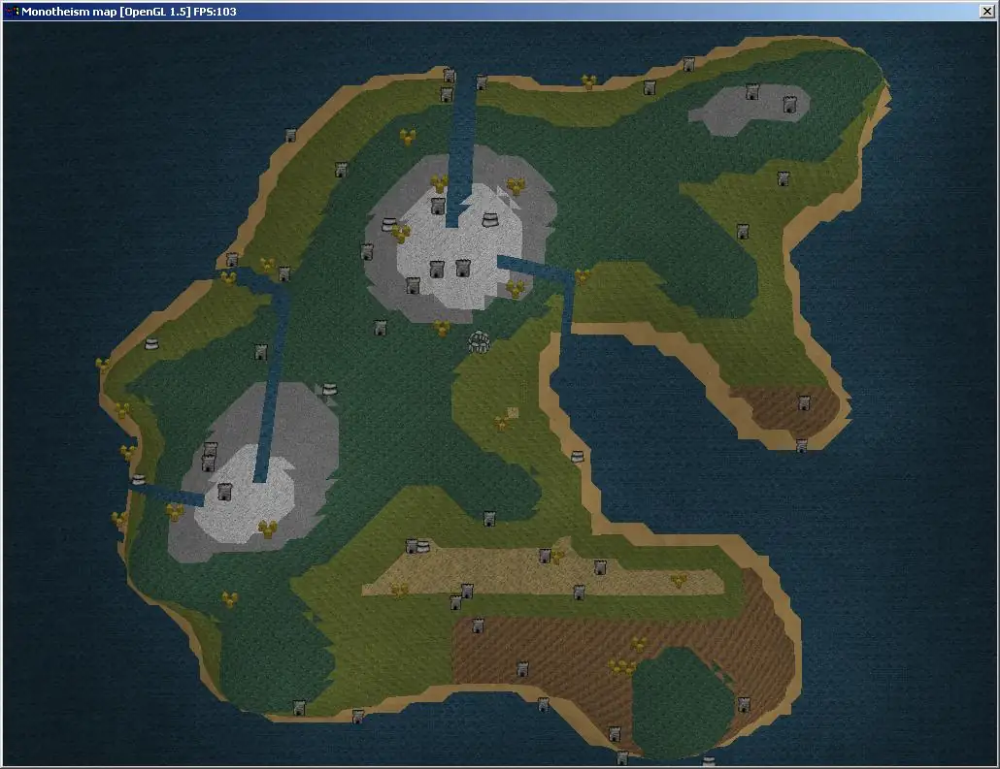
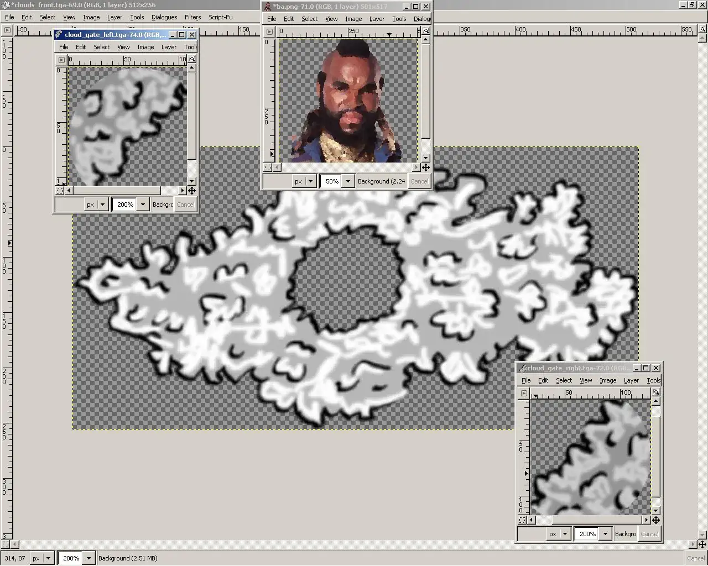
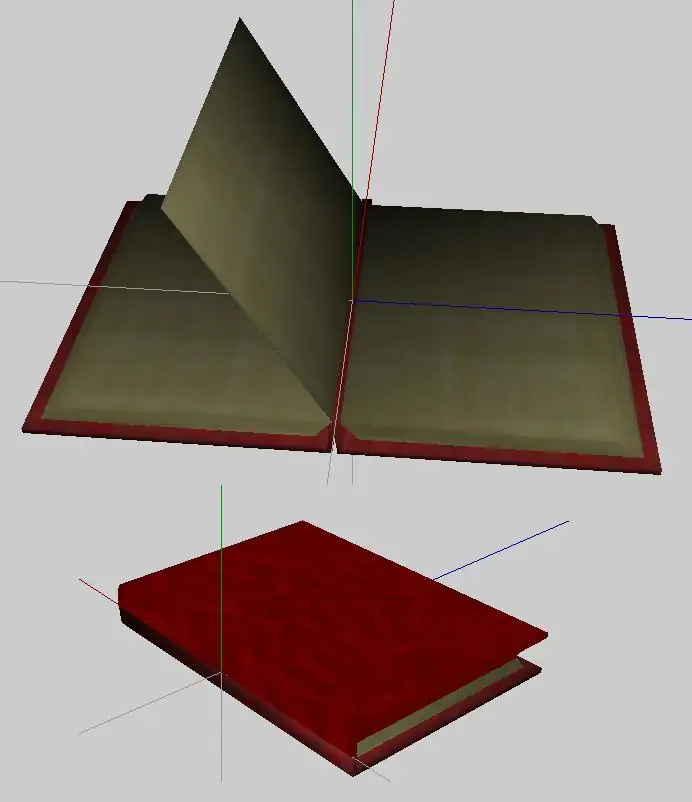

# Monotheism

I never finished this game, never really started it to be honest, but it
did inspire a few of the nodes that I made for Irrlicht.

## What it's about

A game in the style of Moonstone on the Amiga, but iterative so the more times
you play it the more you unlock. 4 gods play a game of Monotheism, a board game
where the board is a small island chosen at random:

|  | 
|     | 
|       | 

The map generator being the sky in the distance, which was the reason for the
[RTT skybox](../skybox).

The game text exists in book form, like a "choose your own adventure", generated
from stuff like this:

```text
Mount Olympus was quiet, there was once again nothing decent on television
and the Internet hadn't been invented yet. An eternity of thumb twiddling had
taken its toll on the gods, twenty thousand lifetimes of bickering had left
them sore, irritated by each others company and unable to start a conversation
for fear of broken furniture and bruised egos.

"I'm bored" boomed Odin, shattering the silence. It was another ten full
seconds before anyone bothered to respond.

"It’s because you're all boring," huffed Loki, at the entire room, "All you
do is sit around stuffing your fat faces, you're supposed to be gods!"

"I am NOT fat", Aphrodite piped up, but he stomped over the top of her, "At
least I bother to go out there and do some work."

"THAT's what you call it, is it?", intteruped Thor, "The virtuous occupation
of sheep worrying, destruction and deflowering young maidens? It beggars
belief you even have any followers at all."

"The only sheep I worry are your pitiful excuse for men..." and on it went,
squabbling like children until someone - nobody remembers who - suggested
playing a game.

"Oooh goody!" Aphrodite was, as usual, up for it. "A game? What shall we
play?" knowing full well that there was only one game that everyone would
agree on.

Monotheism, a game of great sacrifice, played sat safely in the clouds
issuing commandments for mortals to suffer, for purposes of divine
entertainment.

A true game of the gods, and much like the gods, the rules are simple:

A champion chosen by each player is to obtain four sacred items and return
with them to a central shrine before the others. And the prize? The heads
of all opposing followers in the realm.

"I'm not playing unless...

Menu (if unlocked):
 * Easy (4 players - 1 evil, 2 neutral, 1 good)
 * Medium (6 players - 2 evil, 2 neutral, 2 good)
 * Hard (8 players - 3 evil, 3 neutral, 2 good)
```

With the menu book being able to render the map, turn to specific pages and
be responsible for decisions in the game, as well as cut scenes in the style
of Monty Python: 

|  |  |
|      |    |

## Alas...

The task was too big. I did write a Python object system, but this was the time
before LLMs and GenAI, so the content and code creation were a pretty heavy
burden. And in free software you've got a lot of rabbit holes. Irrlicht provided
me with plenty.

It'd be nice to finish it one day though using modern tools. It's not very
likely though tbh!
