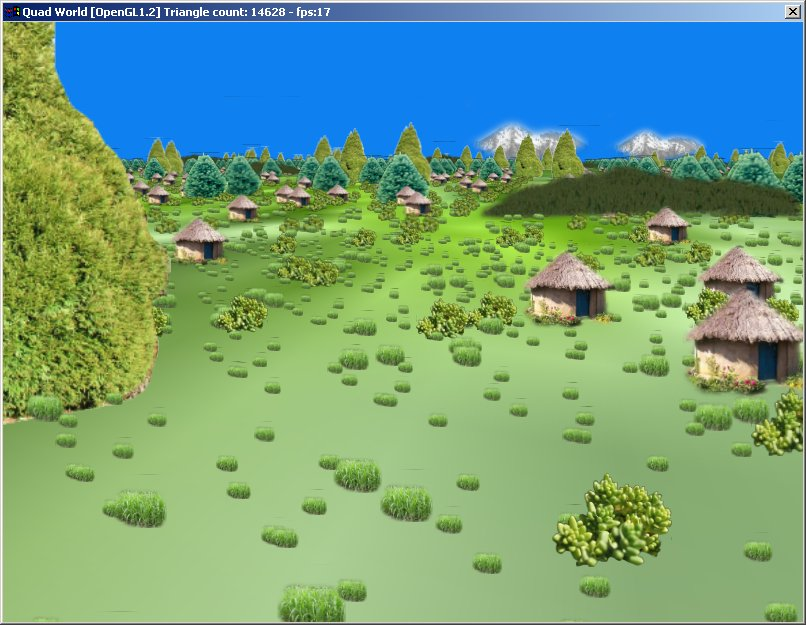

# Plant LoD Database

A proof of concept based on Paulo R. Oliveira's scene graph quad tree filter,
but with a twist: use a SQLite database to store the object references, and
attach plants, buildings and so on to different levels so they load and unload
as needed, allowing you to have a scene with millions of objects

A first iteration of a ghetto version of the stream loaders that you see in
modern 3D engines.

(click for video)

Download it [here](plantlod.zip)
