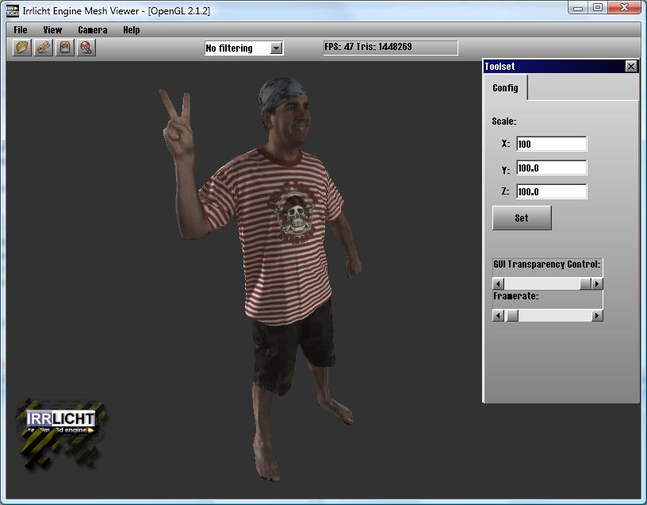

# Stanford Polygon Mesh Loader

A mesh loader for Irrlicht that is blisteringly fast when loading ASCII models,
because I cheated by null terminating the strings in RAM rather than copying
the memory. It could possibly be made a bit faster by rewriting `atof`, but
it's 3x quicker than Stanford's reference implementation, which I thought was
pretty good for a lay-hacker without a computer science degree.

It's been included since [Irrlicht 1.6](/log/2009/09/irrlicht-1-6-released/),
but it's here too in case that ever changes:

[.cpp](CPLYMeshFileLoader.cpp) |
[.h](CPLYMeshFileLoader.h)
