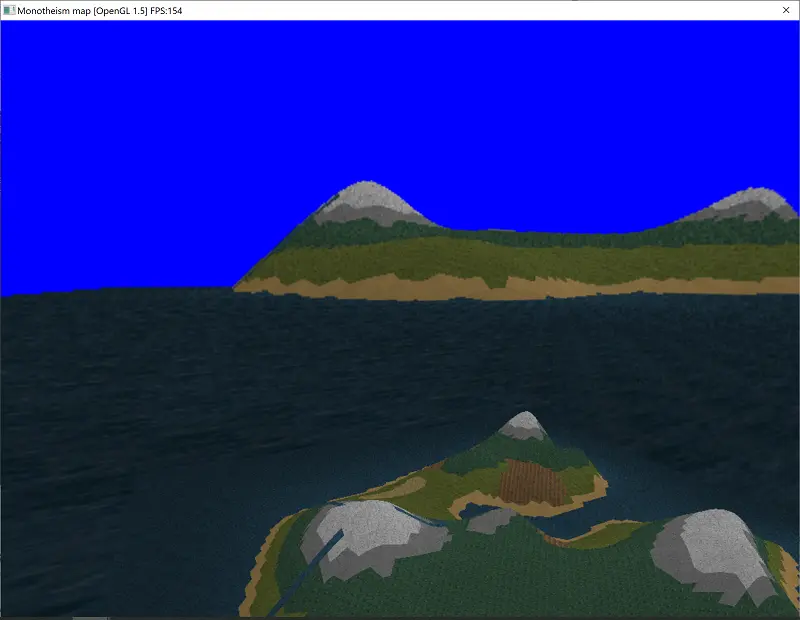

# Render to Texture Skybox

Render a scene into the skybox, progressively if you like. Allowing you to
render tons more detail than you otherwise could.

[⏯
](https://www.youtube.com/watch?v=yae9rjVwEJ0)

download:

[cpp](CRTTSkyBoxSceneNode.cpp) |
[h](CRTTSkyBoxSceneNode.h) |
[exe demo](rendertoskybox.rar)
