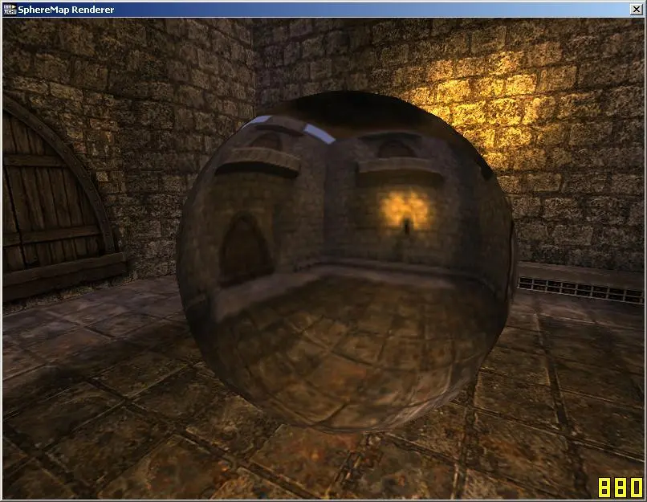

# Spheremap Renderer

Rendering to a spheremap, for use in directional lighting effects.

1. render the scene to the sides of a cube
2. render cubemap to texture via a premade hexahedral sphere
3. apply texture to mesh

Step 2 must be done each time the camera is moved

[⏯
](https://www.youtube.com/watch?v=DN6aXR8f14o)

download: TODO
