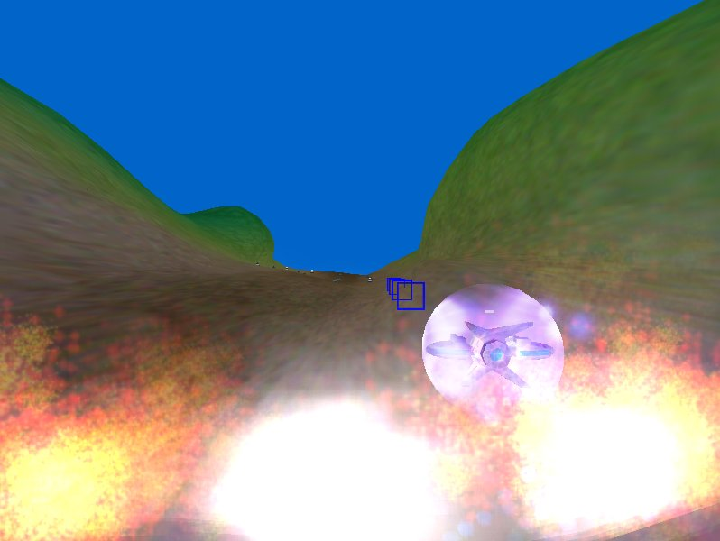

# Unfinished UFO game

Graeme and I loved Lylat Wars on the N64. The game had this wonderful feeling of
space and choice, while constraining the player to this pre-made track. Now, we
are not Nintendo, but we kinda had all the tools - or at least we thought so. He
was a 3D animation student with access to 3D Studio Max and Maya, and I had a
compiler and decided to learn C++.

I picked up the Irrlicht Engine and we started hacking. In hindsight, the
problem was that no large studios were using Irrlicht to make games, and the
content creation pipeline was immature as hell. Like the obj exporter exported
things inside out, the X format was borked, and nobody supported it because they
were all too busy using Blender instead.

So while this was the reason I learned Irrlicht and ended up on the team, I
ended up getting sidetracked by joining the dev team and making all kinds of fun
things rather than fight against hacked proprietary software that I didn't want
on my machine. Windows was enough proprietary software for me, and I was a
copyright reformist with a deep bigotry towards walled gardens. And with
girlfriends, fishing, skateboarding, graffiti, piracy and free culture side
projects, we didn't have the weeks to spend on the game like we used to in the
[old days](../../amos).

So, we never finished the game. But we did have a lot of fun making content, so
there's that I guess.

Here's a video of where we got up to: [video](https://youtu.be/HmNN7z-bkcM)

TODO: find the code. it's in here somewhere.
