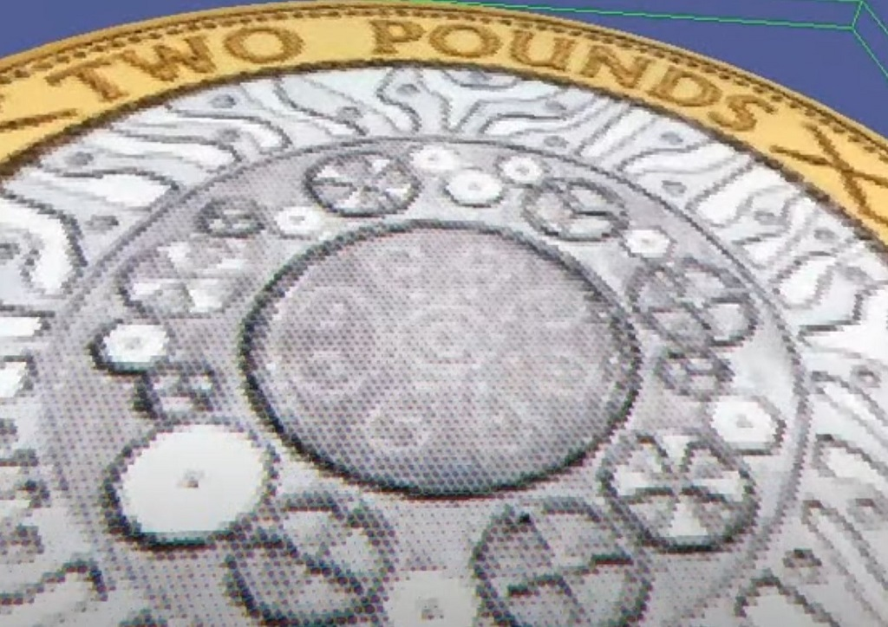
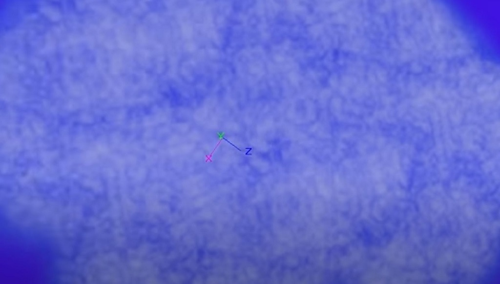

# GLSL / HLSL

Graphics shader languages are pretty fun to program in, pity I didn't do
more of it to be honest.

Here's some videos:

## Comic Book Shader

[download](comic_book.rfx)

## Clouds

Can't find the code for this one

