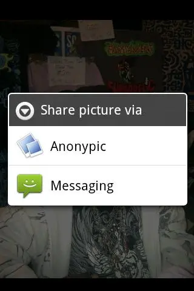
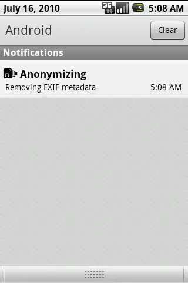

# Anonypic

Anonypic is [was] my first attempt at making an Android application, it’s a
simple service which lets you send images to bayimg.com from an item in your
share menu:

|  |  |

Bayimg remove your EXIF metadata once you’ve uploaded it, so you don’t give
away your location or device’s serial numbers.

## dead

bayimg.com has gone nowadays, but I took the app down before that because
I realised that TLS interception was a thing, that the NSA ruled the world,
that you can fingerprint the CCD and so on. I don't seem to have the code
handy, but if I find it I'll add it here.
