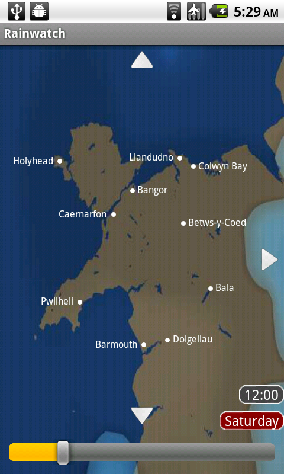
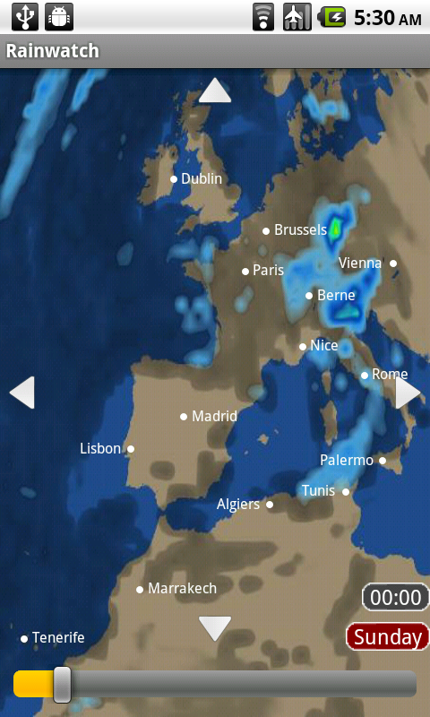

# Rainwatch

Rainwatch is an Android alternative to the BBC Maps Presenter, the flash
application on the BBC Weather website, it provides visual local weather
reports but is mostly useful for rain. When you open the app it will detect
your rough location using nearby phone masts and WiFi networks, then display
the closest region to you like so:

|  |  |

Scroll the slider to see the bursting clouds push across the screen, this
gives you a pretty good idea of whether it’s going to rain or not at a
specific time. As the weather becomes more unpredictable they will become
larger and less sharp, keep in mind that when the weather reports say it will
be "unsettled" it means that the MET office don't really know what's going to
happen. You can also use it to browse the world's weather, though you can't
zoom in and it's only updated twice a day:

## dead

So the BBC made their own HTML5 version and the API that the flash version
I reverse engineered was eventually taken offline. I was due a cease and
desist for abusing their flash API anyway so I never fixed it. And their
new version wasn't as good as mine or the old flash app, which is a real
shame. Oh well.

If I find the source code I'll put it online here.
