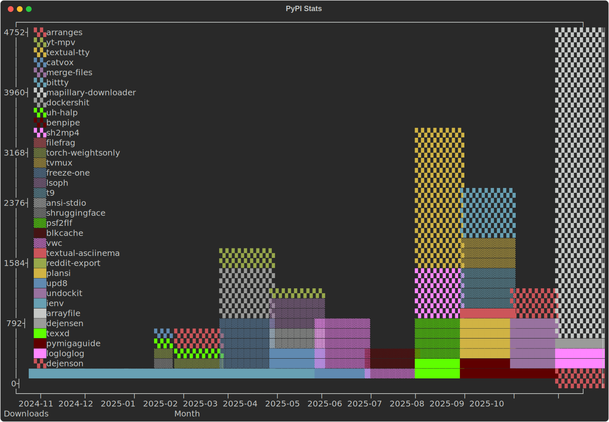

# 🐍 Python stuff

I've been programming in Python since about 2001. I think it was Mo Patel, the
legend that he is, who showed me the ropes while we were doing C/C++ while load
testing software for the Department for Work and Pensions.

Python's probably my favourite language and has been a constant throughout my
adult life. Back then I would have called it a modern BASIC. I still think
that's a fair comment.

* 📈 [Stats](https://github.com/bitplane/pypi-stats/)

## 👨‍💻 Devs

* 🎓 [example-python-project](https://github.com/bitplane/example-python-project) -
  A template for Python projects developed in vim/vscode on Mac/Linux.

## 📦 Apps

* 🧥 [dejensen](dejensen) -
  remove pauses from presentation videos.
* 🗺️ [mapillary_downloader](mapillary_downloader) -
  download your Mapillary data before Meta delete it.
* 🐳 [undockit](undockit) - 
  run apps in docker containers like they're native apps.
* 👽 [reddit-export](reddit-export) -
  dumps your Reddit messages and posts to JSON.
* 💾 [pymigaguide](pymigaguide) - 
  a TUI and converter for Amiga `.guide` files.
* 🔤 [psf2flf](psf2flf) -
  convert bitmap fonts to figlet fonts.
* 📺 [textual-tty](textual-tty) -
  a Textual widget for bittty.
* 🔢 [texxd](texxd) -
  a hex editor for the terminal.
* 🧊 [blkcache](blkcache) -
  a userspace disk cache for CDs, DVDs and floppies that are dying.
* 🚻 [vwc](vwc) -
  `wc` but with a live preview as it counts.
* 📂 [lsoph](lsoph) -
  slop-driven TUI for `strace`, `lsof` and `psutil`
* 📺 [yt-mpv](yt-mpv) -
  archive youtube videos while you watch them ad-free.
* 🐳 [dockershit](dockershit) -
  create Dockerfiles in an interactive shell.
* 🛟 [uh-halp](uh-halp) -
  AI helper for the shell.
* 🗣️ [catvox](catvox) -
  mouth sounds go in, text comes out.
* ➕ [merge-files](merge-files) -
  A universal file converter, extractor, merger. Not quite, but the blueprint
  for one.
* ⚠️  [ienv](ienv) -
  Brutalize your venvs by symlinking them together.
* 📑 [ocr-pdf](https://github.com/bitplane/ocr-pdf) -
  Use Optical Character Recognition to convert a PDF to TXT.
* 🪈 [benpipe](https://github.com/bitplane/benpipe) -
  Pipe bencoded data (torrents) to JSON and back again

## 📚 Libs

* 🗔  [bittty](bittty) -
  a pure python terminal emulator.
* 🪵 [logloglog](logloglog) -
  resizable indexed tailing logs for TUIs.
* 📃 [arrayfile](arrayfile) -
  A file-backed array.
* ✅ [upd8](upd8) -
  a versioned class for identity and update checking.
* 🤷 [shruggingface](https://github.com/bitplane/shruggingface) -
  ungate those models, they're public domain anyway.
* ⛰️ [arranges](arranges) -
  Represent ranges as strings in Pydantic.
* 📈 [interpolist](interpolist) -
  A list that fills in missing values.
* 📱 [t9](t9) -
  A Python implementation of Nokia's T9, from back when that was a thing.
* 🗄️ [filefrag](https://github.com/bitplane/pyfilefrag) -
  Python library to access Linux File Extents

## 🦶 Stubs

* ❄️  [freeze-one](https://github.com/bitplane/freeze_one) -
  like `pip freeze | grep package` but safer
* 🔦 [torch-weightsonly](https://github.com/bitplane/torch_weightsonly) -
  stop torch from spamming when loading a model

## 💣 Hax

* 🐈 [schrodinger's rng](https://github.com/bitplane/schrodingers-rng) -
  Generate proveably random numbers using a smoke alarm and a webcam.
* 🍾 [bubbler](/log/2012/02/airlock-mic-project) -
  Count bubbles as your beer or wine ferments.
* 🌡️ [temper](https://github.com/bitplane/temper) -
  Linux driver for temper digital thermometers.
* 🐌 [connection-limiter](https://github.com/bitplane/connection-limiter) -
  The hackiest way to limit connections per user to a back-end behind nginx.

## 🕸️ Older projects

* 🎹 [XBMC IRC](xbmc) -
  an IRC MP3 downloader for XBMC (Kodi).
* 🔎 [Google Remote Desktop Search](rgds) -
  Search your local machine remotely.
* 🖼️ [favicon to png](https://github.com/bitplane/favicon-to-png) -
  Tiny script to convert favicons to PNGs on the fly and cache them.
* 🕷️ [Scrapers](scrapers) -
  Numerous data scrapers for various sites.

## 💷 Commercial stuff

* 🕵️ At NDA PROTECTED CLIENT, I've been writing bots and command line tools and
  libraries in Python.

* 💳 For [First Response Finance](https://www.firstresponsefinance.co.uk/), I
  wrote an ML Ops inference and deployment framework for delivering Python + R
  machine learning models as APIs to Azure.

* 🎰 At [William Hill](https://www.williamhill.com/) I wrote note and coin
  acceptor drivers for multiple devices, and a bunch of other things for a
  gaming machine.

* 📈 For [Betconnect](https://www.betconnect.com/), I did a bunch of performance
  engineering for their exchange software.

* 🦻 At [Sonocent](https://glean.co/), I wrote a BI platform to support business
  experiments.

* 🩺 At NHS Digital, I worked on the SPINE 2 project doing various things, probably
  the biggest TDD Python codebase in the world.

* 🎻 Someone on bitcointalk paid me 6 Bitcoins to write a data scraper for a
  violin sale site. I wish I'd kept them, they were worth $36 at the time.

* 🃏 At BetFair, I used [funkload](https://github.com/nuxeo/funkload) for
  performance testing and submitted a couple of bug fixes and made some pretty
  nice results visualization/reporting/diffing tools for perf tools in CI.
  Didn't get permission to share the reporting tools, so all that survives is
  a bug report!
