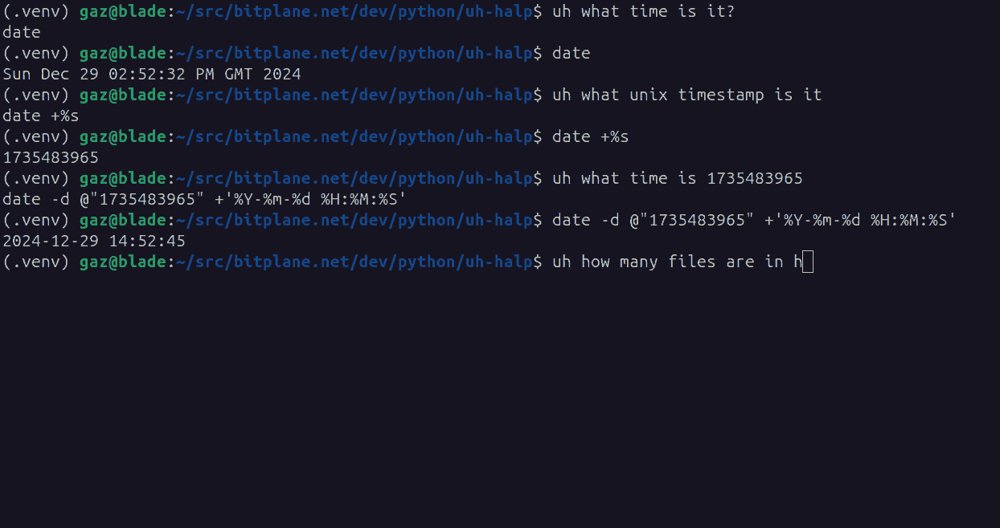

# uh halp



Install:

```bash
pip install uh-halp
```

Configure:

```bash
$ uh halp?
>>> Need an OpenAI key, it'll be saved to ~/.uh-key: <paste here>
Sure, what do you need help with?
```

Usage:

```bash
$ uh check my syslog
tail -f /var/log/syslog

$ uh clean up docker disk space
docker system prune -a

$ uh sync this shit to /home/gaz/project on gaz@server
rsync -avz --progress . gaz@server:/home/gaz/project

$ uh how much space have I got free here?
df -h .

$ uh gimme a socks proxy on 192.168.0.1
ssh -D 8080 username@192.168.0.1

$ uh check if the internet is up
ping -c 3 google.com

$ uh make annoying beeping noises randomly in the background forever
while true; do echo -e "\a"; sleep $((RANDOM % 10)); done &
```

## Notes

Models of alignment other than Lawful Neutral are planned in future, but
currently uses OpenAI's GPT. So official policy is to cry if you ask it to do
anything bad, ask it to swear, or are otherwise naughty.

It's using the cheapest model and will get things wrong, so y'know, look
before you paste. There's also no protection against doing things like
`$(uh how do I break this computer?)` at the moment. So please don't just
execute its output!

Lacks testing, `works_on_my_machine.jpg`. Should also work in Windows as the
shell and OS details get passed to the system prompt. But it might not!

## Disclaimer

If it blows your machine up it's your own fault. Don't run code produced by
a language model without reading it, their breadth of knowledge is matched
only by their depth of stupidity.

## License

WTFPL with one additional clause: don't blame me!
