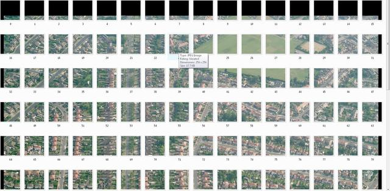

# 🗺️ Virtual Earth Grabber

There's zero chance of this working nowadays! At the time there was a cat and
mouse game going on with people selling licensed aerial photography.

* [🐱 github](https://github.com/bitplane/virtual-earth-grabber)

Microsoft Virtual Earth Bird's Eye photography grabber.

Uses OpenStreetMap coordinates to define an area, downloads the satellite tiles
from Virtual Earth, then stitches them together using a small C++ program built
with the Irrlicht Engine.

## Usage

1. Go to www.openstreetmap.org and zoom in on the top left of the area you want
2. Click the "permalink" button and copy the URL
3. Edit `startLat` and `startLon` in grabber.py to match
4. Do the same for the bottom right (`endLat` and `endLon`)
5. Run the Python script - images are downloaded and stitched automatically
