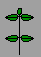

# Animating bitmaps

Okay not the most impressive thing by today's standards, but probably worth
dumping these here as a sign of the times.

Back in 1999 it was all desktop software, and Microsoft had the web locked down
through IE6 so there was plenty more to come before Mozilla took back the web.
People hadn't standardized on the progress spinner either. It was a time of ugly
animated cursors, file dialogs and dial-up modem connections showing a spinning
world. So I'd have to learn to make those if I was to make stuff in similarly
poor taste.

I remember switching from the Amiga's excellent Deluxe Paint to Paint Shop Pro's
animation program being like working with one hand behind your back, so I think
these were actually made on my Amiga then transferred to the PC.

I think this is the only tasteful spinner, it still think looks pretty good:

This, on the other hand, is exactly the sort of thing that doesn't:

This globe trick was common in the Amiga days, you make a rectangular image with
the same image at each horizontal end, then fill in the middle. Then you make a
mask and stamp it over the top. Move the bottom layer across by a couple of
pixels, save as a frame, repeat until you reach the start. Then realise you
didn't count the pixels properly, so it stutters at the end, and you have to do
it all over again.

I was pretty chuffed with this one at the time, using the symmetry tool and
curved lines to make the outside frame by frame, then put the question mark in
the middle bobbing about. In hindsight, this didn't age well, it's the kind of
thing you'd expect on a colourblind geocities website that's been
`UNDERCONSTRUCTION.GIF` for 15 years. But at least it'd load faster than those
3D dancing aliens.

## Downloads

* [source with bitmaps](src.zip)
* [hammer animation in action](hammer.zip)
