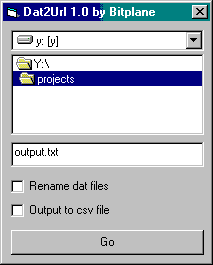

# Dat2url

My most exciting adventure with a hex editor since Elite's save games!

This is a little program I wrote to open Kazaa DAT files and convert them back
into a sig2dat URL. The idea was/is, you can search in K++ overnight for the
most popular files on the network, then double click on them all to export the
DATs. Then you run the program and make a list of sig2dat URLs.

It only works on DAT files that haven't started downloading yet, and saves the
results to a text file.

I'd suggest closing Kazaa before using it.

* [binary](dat2url_b.zip)
* [src](dat2url_s.zip)