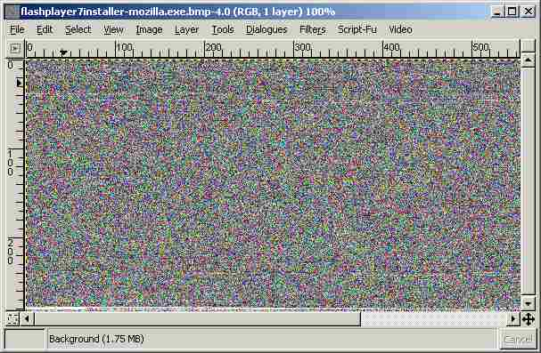

# Mail Filter Evasion: File 2 Bitmap

So Microsoft stopped shipping Access with Office, making my
[filestore.mdb](../filestore) hack useless on most machines in the office. But
the DWP hadn't learned to block untrusted EXEs yet, so we could use this thing
to pass files around instead:

I had to XOR the files because the mail filter had got a bit better in the 3
years since filestore.mdb

[download](file2bmp.zip)

