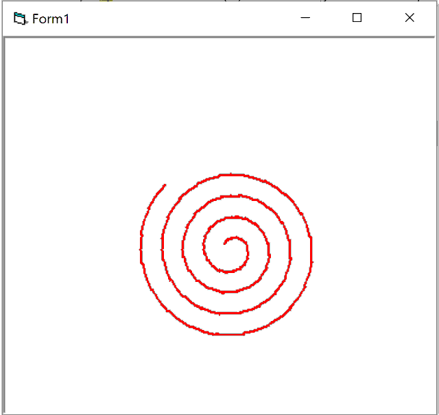

# spiral.exe

A spiral effect made at Alpha Training while learning VB6. Funny story here,
I remember this not working and me not understanding why, and asking the course
assistant Brian why, and he said it's because I'd used 22/7 as PI. I didn't
know what a transcendental number was at the time, and 24 years later I don't
know what a rotation even is. I don't think anyone does.

[download](spiral.zip)

