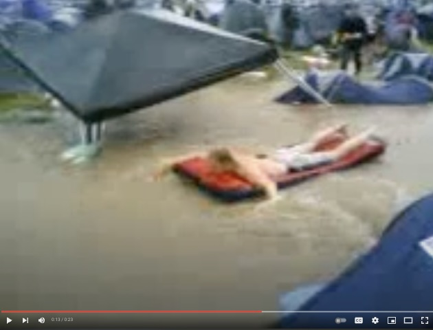

# Glastonbury 2005

So we were camped on Pennard's Hill in 2005, front seats for the floods and
a personal invite to permenent mental health issues.

The weather was crazy from the start. Firstly, glorious sunshine that's not
so glorious if you're ginger and sunburned and it's 7AM and you've been up
until 6 getting thoroughly dehydrated. Then came the freak gusts of winds,
mini-twisters flowing up the hill to a Mexian wave of screams and cheers, as
tents rose into the air then came crashing down. In one act of foreshadowing,
a gazeebo from a nearby group took flight and landed upside down on one of our
camp's tents, snapping a pole. In another, a flash of hailstones - mid-June and
mid-heatwave - had everyone laughing in bemusement, oblivious or in denial of
the warning it served.

Then the rain arrived. Thursday night became Friday morning and we awoke to the
rumble of thunder. "Get up, check your tents!" - colleague-turned-friend
Ged. (I never saw him again afterwards, I heard a rumour he joined a commune but
all we really know is he turned his phone off and never made it back to work.)
Anyway, make a joint, bimble off to get coffees, and when we got back the main
event had started without us:

> The worst of the storm damage came when a river running through the site
> burst its banks and sent a torrent of water through a field of tents.
- [The Guardian, June 2005](https://www.theguardian.com/music/2005/jun/24/glastonbury2005.glastonbury3)

The slowly rising water table had revealed itself to be flowing, which is fucking
obvious in hindsight when you consider we were on a hill, but it was hard to see
the camp for the tents. Ged, who had assured us during the wind incidents that
he hadn't brought anything he wasn't willing to lose, saw his tent buckle under
the weight of the water and as it was squashed flat. Mine, a slug-shaped one man
sleeping-bag-on-the-ground kind of deal was flooded, I managed to drag it out
of the carnage and set it aside. Thankfully most of my clothes were in bin bags
so were mostly dry, most of the XTC pills had turned into a cake in the bag, and
my weed was drenched too. Becky, a girl from the Isle of Man who we'd met
on the train, her tent was crushed and its contents including clothes, phone,
purse, keys and train tickets sailed down the hill into a lake of mud and
upturned toilets, never to be seen again.

The festival spirit didn't leave us though. Joking about it, buzzing from the
excitement and tales of the Pyramid Stage being struck by lightning, offers of
help and the sunshine threatening to return and dry everything out. People sailed
through the camp down to the bogwash, it'd all be okay. Get back to the business
of getting wasted and winging it, sorting things out as they showed up.

That's our gazeebo right there.

Then the sun started to set. Cold, tired, damp and missed all the act on Friday,
the mood had changed - but I woudln't say "sobering"; true to form, I'd stuck to
the original plan and carried on drinking and dropping X all day. And through
the night too. And the next day. And the one after. My brother, who'd lost his
tent shared my floor slug. He and Danny split the pill cake in half and necked
about ten conjoined tabs each, I guess because fuck it, what's the worst that
could happen?

I didn't see Danny for 10 years after that, for a while I thought he was dead
and nobody would tell me. That's what the voices would tell me all the time.
Turns out he'd messed his brain up in a similar way to me, depressed and
somewhat recluse, but without a family history of schizophrenia.

So, as the weekend went on I endured a descent into madness, I paced round in
constant panic thinking I was being followed, and if I went to sleep I'd get
stabbed. Food was off the menu as poisoned, everyone hated me for being so
jolly at a time of such misery. They didn't, and for the next 6 months steet
signs and car registration plates weren't taunting me with unknown, ominous
warnings. I had to stop smoking weed as was now an amplifier of an almost
permenent psychosis, as is the insomnia that made me good at computers.

I never really recovered from that year. The brain, it seems, is far more
delicate than you'd think.
