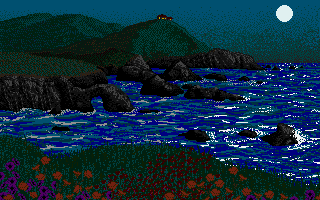
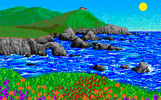

# seascape.iff

Seascape was my personal favourite demo picture from Electronic Arts' infamous
pixel painter "Deluxe Paint", it wasn't on the web so I thought I'd put a copy
here on my site.

When you open the picture in dpaint you're faced with a moonlit seascape,
presumably drawn by hacker-artist Dan Silva. It's a pretty nice demo of what
the Amiga can do with a 32 colour Lo-Res screen; a beautiful, oil painting in
pixels. Arguably a bit dull, but beautiful nonetheless: 

However, when you revert back to dpaint's default palette, something magical
happens!

Dpaint was a Killer App, and it was argued that the image of 
[King Tutankhamen](./seascape/dpaint3.jpg)
sold countless thousands of Amigas. For me though, it was seascape.
