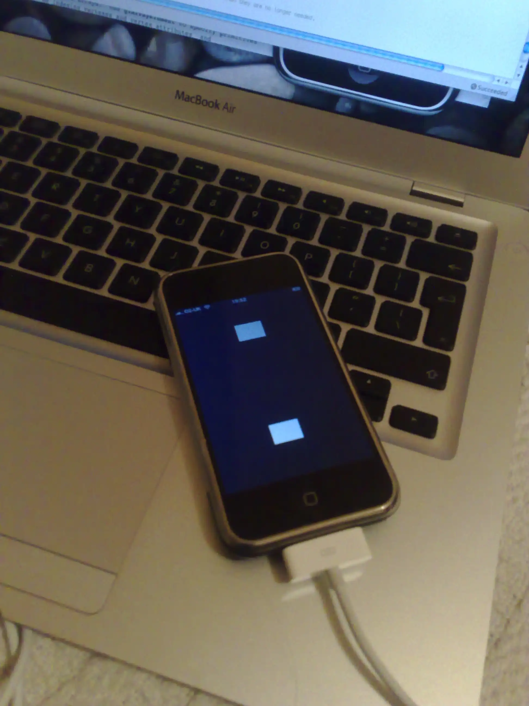
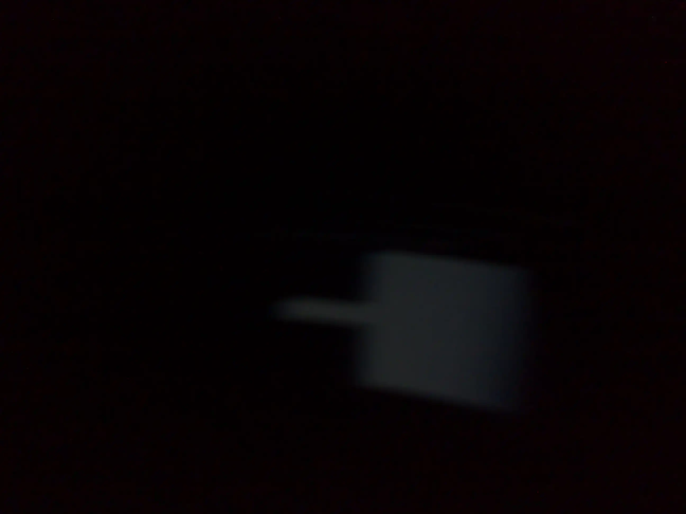
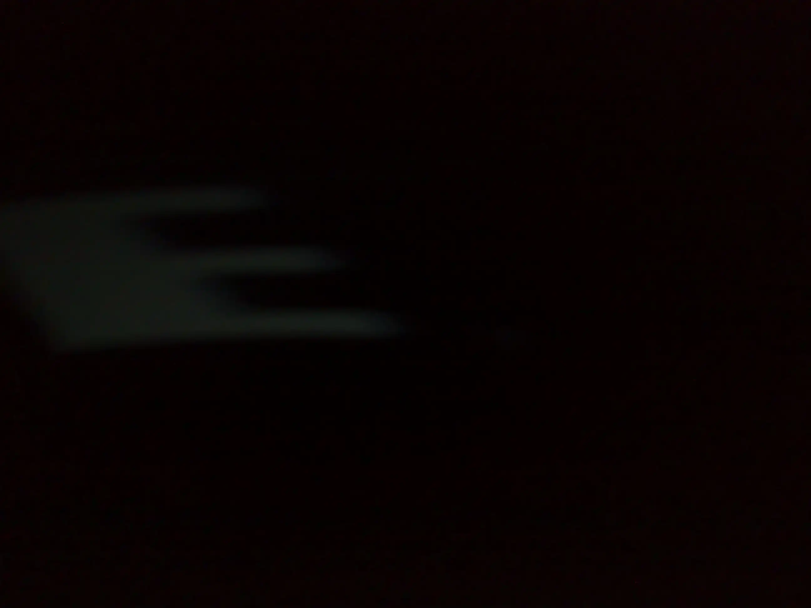

# 📱 iOS space writer

Around Christmas this year, serial entrepreneur Mark Paul (later the founder
of [Fallen Planet Studios](https://www.fallenplanetstudios.com/)) had an idea
to make an iPhone app that's a "space writer" - those LED signs that you wave
back and forth to write a message in the air.

Should be possible with the iPhone's accelerometer, right? So yeah, I'm game;
he can do the graphics, marketing and business side of things, I'll do the
low level code, and we'll get rich making toys for phones.

A few days of messing about in Xcode, it turns out I can smooth out the noise
from the accelerometer and get the timing right, and I can get the screen to
display a strip of light that represents the letters:

But... the screen isn't fast enough, so all it can display is "HI", and only
in a dark room. 

|  |  |

Oh well, fun project and learned a bit about the iPhone and mobile dev.

