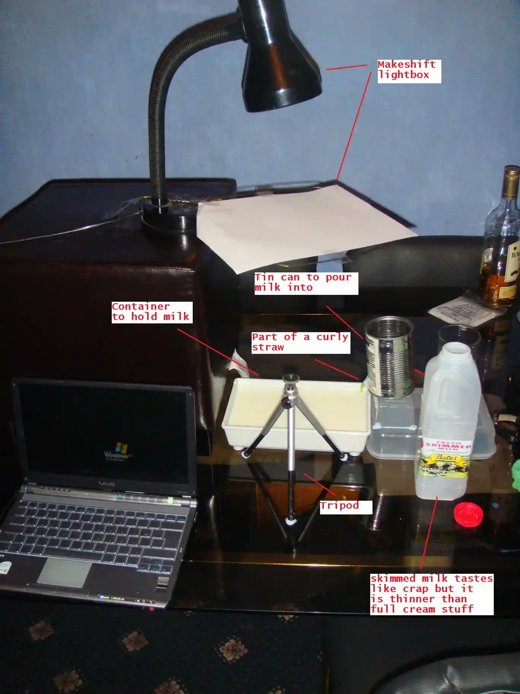
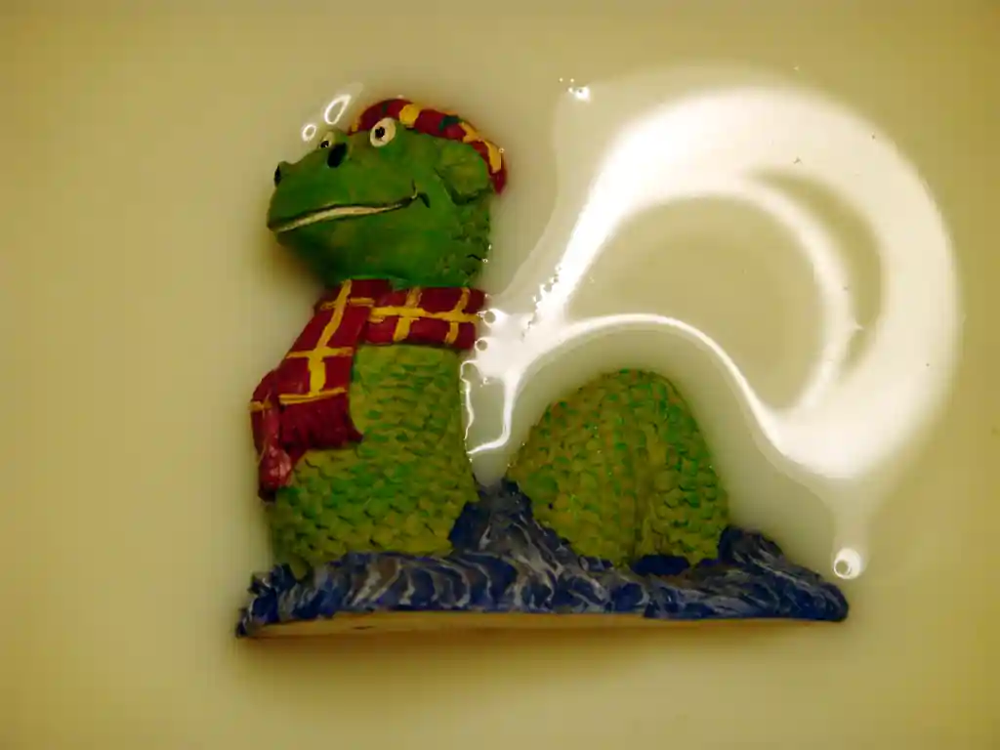
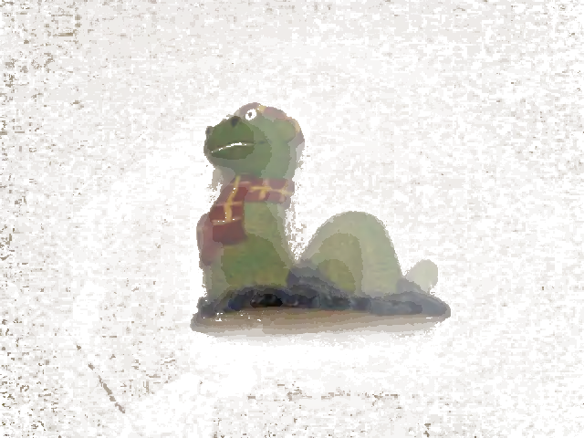
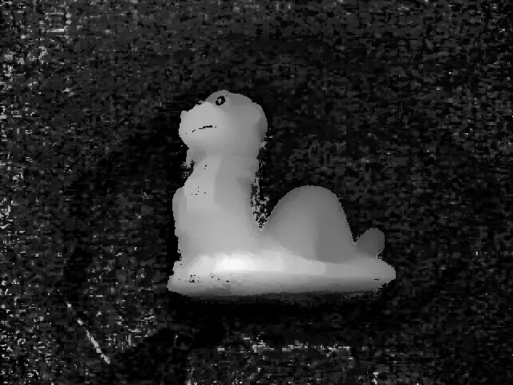

# 🥛 Milk Scanner

A 3D scanner using a tray of milk. I can't find the link right now but it 
wasn't the first, and I can't remember if it was an independent invention or
not.

The setup looks like this:

## Ingredients

* A makeshift light box using a desk lamp (stolen from my mum), a coat hanger,
  tape and a sheet of A4 paper. Taped to one of Katherine's footstools.
* A tin can with a hole punched in one side, and a curly straw blu-tacked into
  the hole to pour the milk into the tray. The can probably contained soup.
* A tray that I guess had some kind of stationary in it.
* Kath's compact camera and tripod, the camera did video.
* A volunteer ornament stolen from my mum, probably from a visit to Auntie
  Carol and Uncle Steve's.
* A bottle of whatever that is. If it was any good it'd be empty.

## Method

So you pop your item in the dish, point the camera at it, and record a video of
it gradually submerging into the milk:

[⏯
](https://youtu.be/XBiYmA2Ik9M)

Take the output and run it through an edge detection filter, then this program 
[TODO: find code and link it here]

This looks at each pixel and records when it turned white. The longer it takes,
the closer to the surface it is. Divide by the total time, and you have a depth
map that can be used to reconstruct the surface.

Join with the diffuse channel, you've got a texture map with depth, that can be
converted into a normal map or tessellated into a mesh:

|  |  |

## Notes

SFM techniques made this approach worthless, but it's still pretty cool. I did
try a different approach using a laser but never finished that, similar way to
how [book scanners](../../../2018/09/scanner) flatten pages.

Here's a link to another one that someone made
[7 years later](https://hackaday.com/2016/04/16/milk-based-3d-scanner/).

