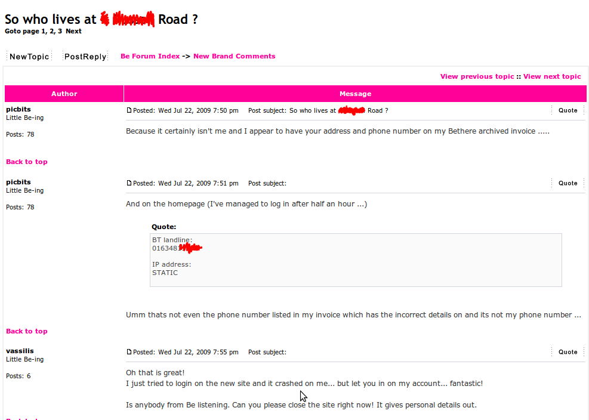

# Be Internet rebranding fiasco

My ISP,
[Be Internet](https://web.archive.org/web/20091207064343/http://www.bethere.co.uk/)
just went live with their new website and even though I’m a tiny minority in
thinking this, I quite like the new layout. It has REST-like URLs and social
media bookmarks, it even uses the strict XHTML DTD, which is refreshing.

However, the design is the only thing I like! The new site has not only
collapsed under the load, but users are reporting that
[they are seeing other people’s account details](https://web.archive.org/web/20091207064343/https://avatar.bethere.co.uk/forum/viewtopic.php?t=28998)
when they log in! Also their SSL certificate is invalid, so you’ll need to add
an exception before you can even visit the site. Their nice new
[Digg account](https://web.archive.org/web/20091207064343/http://digg.com/users/bebroadband")
is apparently “A 14 year-old person from United Kindgom (GB)”

Did Be actually do any testing before going live?

I’d be shocked and disgusted like the other users if I wasn’t a performance
tester, screw ups like this are a wonderful advert for people like me!
