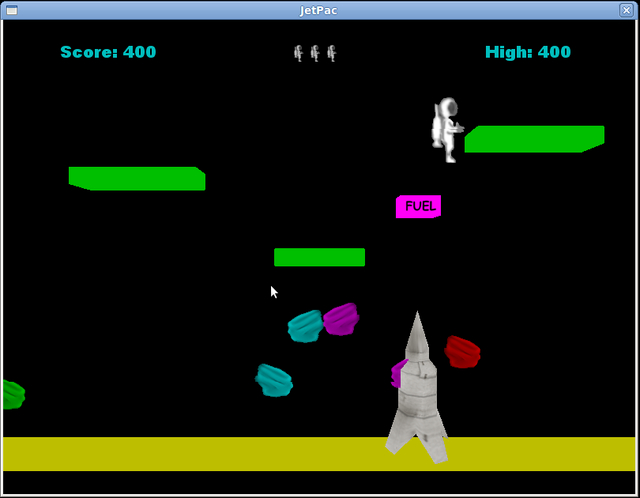

# irrEdit in Wine?

Since my recent hard drive crash I’ve moved from Windows Vista to Ubuntu 64.
I discovered that when trying to run my [Jetpac](https://web.archive.org/web/20091207064343/http://gallery.bitplane.net/main.php?g2_itemId=403)
game under Wine, it fails [for the same reason](https://web.archive.org/web/20091207064343/http://bugs.winehq.org/show_bug.cgi?id=12020)
as [irrEdit](https://web.archive.org/web/20091207064343/http://www.ambiera.com/irredit/).
The crash is because the D3D calls related to shader compiling aren’t
implemented in Wine’s DirectX 9 DLLs, which isn’t a very good reason to bomb
out as I don’t even use any shader materials.

As you can see on the bug report, all that it needed is someone to stub out
the functions and return an error and irrEdit should work in Linux; all fixed
in about ten lines of code, right? Well, sort of. Wine also has some viewport
issues so irrEdit doesn’t render properly, but on the up side Jetpac works
flawlessly.

To see your Irrlicht D3D Windows binaries in action under Linux x64, simply
download the DLL from [here](https://web.archive.org/web/20091207064343/http://files.bitplane.net/d3dx9_36_wine.tar.gz),
copy the dll.so file to /usr/lib32/wine/
