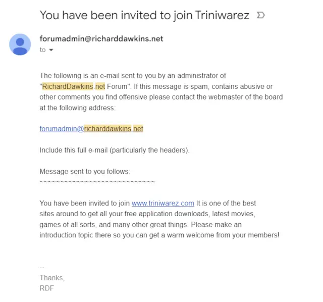

# RDF Defaced

Last night I got an email from the admin of the Richard Dawkins Foundation
forums inviting me to join a warez site, which was rather strange. Of course it
turned out that the site was [broken into](https://web.archive.org/web/20090822065937/http://www.richarddawkins.net/forum/viewtopic.php?f=9&t=90100)
by a [script kiddie](https://web.archive.org/web/20130812145634/http://www.whois.net/whois/cbwarez.com)
and defaced. I’m assuming that the database was downloaded so my generic weak
forum password is currently being cracked, so I’ve took the precaution of
changing it on as many forums as I can remember.

The kid will probably be caught as the attack has been reported to the FBI, he
was stupid enough to use the same email address for multiple accounts and even
post the name of the proxy site he used. This story has a moral though, make
sure you have a strong password for places where you have administrator
privileges, and make sure you don’t mindlessly log into sites claiming to be
ones that you trust. I hope the RDF admins learned a lesson here!
