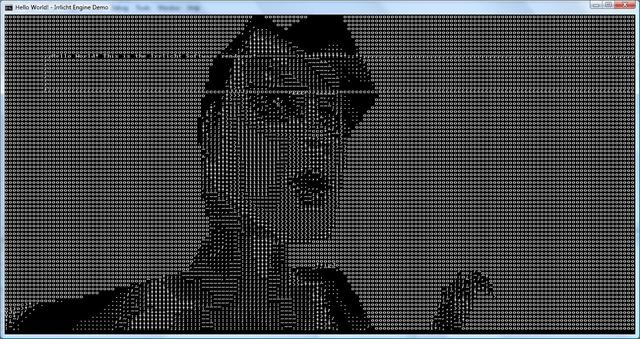
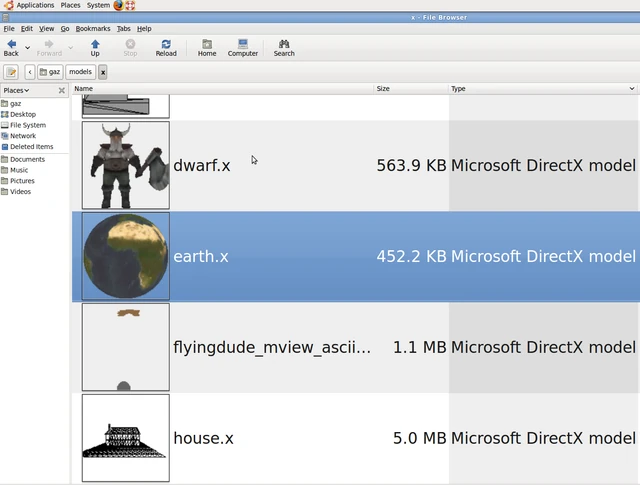
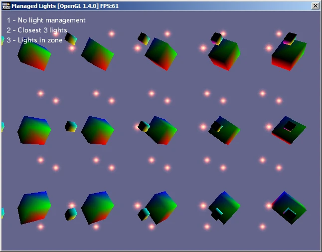
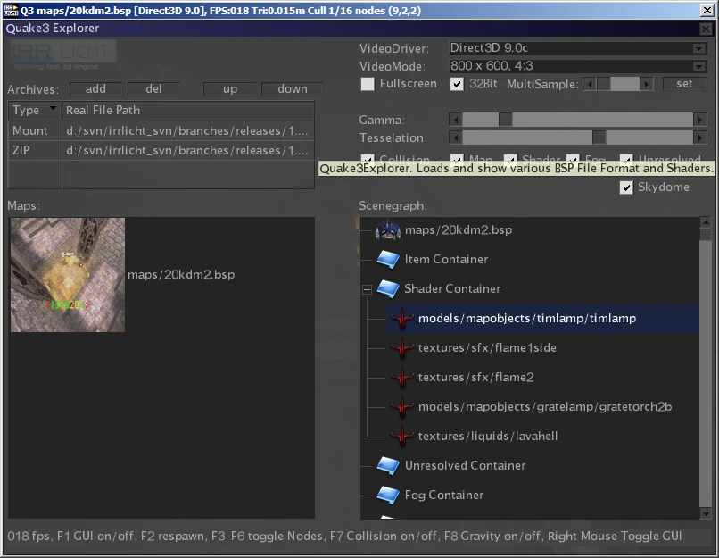

# Irrlicht 1.6 Released

So, we finally released Irrlicht 1.6. This release has lots of bug fixes and
plenty of new features for you to sink your teeth into!

I'm sure I've missed out lots of stuff, but here's a summary of the most
interesting new features…

## Video

Burning's software rasterizer is now at version 0.44 and comes with sphere map,
two layer reflection and transparent alpha ref (plant renderer) materials, plus
lots more enhancements.

It's now possible to specify an override material for the video driver. This
could be used, for example, to draw the entire scene in wireframe. It is
incredibly useful for deferred rendering where you need to render the entire
scene using some specific shader.

New SMaterial settings. Materials now support LoD bias for mipmaps, antialias on
a per-material basis, and a Swiss Army Knife of a feature: disabling writes for
specific colour channels. Combined with the override material this makes
stereoscopic anaglyph rendering really simple:

[missing image](http://irrlicht.sourceforge.net/phpBB2/viewtopic.php?t=33463)
> Luke demonstrates red-cyan anaglyph rendering in 12 lines of code per eye!

Floating point render pixel formats are now supported, currently only in render
targets in OpenGL and D3D, but it still means HDR rendering! The colour
converter doesn't yet support these new formats, but in future this will mean
floating point image loaders meaning native HDR support across the board:

[missing image](http://blog.owned.co.za/?p=71)
> FuzzYspo0n's reflections (BlindSide's method, I think) using SteelStyle's HDR
> image loader to load floating point textures

Direct3D8 finally supports 32-bit index buffers. The D3D drivers can now be used
in the SDL device, and they now render in screen space in 2D mode (0,0 -> W,H).

[Gary Conway](http://www.idcnet.us/) donated an SGI image loader, which means
Irrlicht can now open Silicon Graphics .rgb, .rgba, .sgi, .int and .inta
textures, including RLE compressed ones.

The TGA loader can now load uncompressed 8-bit greyscale and indexed images.

## Core

position2d has been removed, it is now a just a typedef for vector2d. This gets
rid of the need for all those ugly vector to position conversions, even though
they are essentially the same type.

## Device

Irrlicht now has a console device. I added a simple ASCII render just for fun,
but the console device has a serious use, you can use Irrlicht to do offline
rendering without the need to ever create a window which means it doesn't need
an X server on Unices.

> The console device can present images from the software rasterizers

Irrlicht can now also be compiled with more than one device type and select the
best one at runtime. This does increase the size of the library, on OSX you have
the option to compile with the console, Cocoa, SDL and X11 devices which may
seem like overkill. The ability to select the device type at runtime allows the
same version of the shared library to be used with a wider range of
applications, for example my GNOME thumbnailer which runs in the background:

> Nautilus showing thumbnails for Irrlicht supported meshes

We now have an Xbox project too, apparently compiling with Direct3D8 on the
official XDK, but OpenXDK support with SDL is planned.

The device now has get/setGammaRamp functions.

## Scene

RogerBorg's light manager is in at last! Using a light manager you can add
hundreds of lights to the scene and activate the closest 8 to each surface:

> RogerBorg's light manager made it in

Collision enhancements. You can now get the node which was selected in
getCollisionPoint, making it easy to work with meta selectors.
ICollisionCallback so you can be notified of collision events.

ISceneNodeAnimators now have an hasFinished method, so you know when they're
complete.

Irrlicht can now load and save PLY meshes, including massive ones. This is the
file format used by the infamous
[Stanford Bunny](http://en.wikipedia.org/wiki/Stanford_Bunny) and also by
[commercial 3D scanners](http://www.cyberware.com/) in general:

> Loading a massive PLY mesh from a 3D scanner. There are no UV coords here,
> just vertex colours

Quake3 BSPs support is now greatly enhanced, supporting new shader types and
lots of other stuff.

## GUI

The GUI now comes with a tree, which is demonstrated in the new Quake Map
Explorer example:

> Tommi's Quake Explorer demonstrates (among other things) use of the tree view,
> donated by Reinhard Ostermeier

New skin constants for text offsets in GUI windows, allowing nice skinned
titlebars like this:

[picture deleted in imageshack purge](http://img27.imageshack.us/img27/3359/previewmoa.jpg)
> Klaskers GUI skinner, with skin by FuzzYspo0N

## File System

Irrlicht's IFileSystem now supports pluggable archive loaders via two new
interfaces, IFileArchive and IArchiveLoader. This allows users to extend the
VFS by adding new archive types, you can for example lock your data up in a
proprietary archive format, store your meshes in a database, or add ways of
extracting data from current archive formats. Currently archives are still
read only, though this may change in future.

To celebrate this, Irrlicht can now open .tar.gz archives thanks to the new TAR
reader and the fact that the ZIP reader can now open gzip archives.

I'm adding two examples to IrrExt. Firstly a Windows .ico and .cur loader which
treats these files like an archive. This allows you to (for example) use Windows
mouse cursors or favicon.ico files from web pages. Secondly, a Windows PE RSRC
loader, which allows you to load resources from Windows binaries in a cross
platform way. Combined with the .ico loader you can use this to show the icons
of Windows executables from inside Irrlicht. The RSRC loader will be moved over
to IrrExt in a few days, once I've updated it to work with Irrlicht 1.6.

There's now a special type for holding file names and paths. io::path is
currently a string type which may be wchar_t based in Windows. In future all
string based path comparison, replacement and collapse methods will move to this
class.
