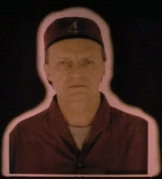

# Lexx Season 4 on DVD

I don’t buy many DVDs. I tend to focus on things of exceptional quality, which,
let’s face it, most films and TV series are somewhere between mediocre and
crap. However, I do like to buy cult classics which most people haven’t heard
of so I can introduce friends to these rare gems. One fantastic example is
Lexx, a strange and sleazy comic science fiction series which is camp to the
point of being homo-erotic, it boasts terrible acting, outrageous plots and the
most sadistic bad guys ever to grace television. I mean “grace television” in
the broadest possible meaning, as it was originally broadcast on Channel 5 at 3
o’ clock in the morning. That’s how popular it is.

I bought the first 3 seasons many years ago after downloading them via Morpheus,
but the final season never got a UK release. However, I just found season 4 on
unencrypted (region 0) DVD at
[cd-wow for £15](https://web.archive.org/web/20091207064353/http://www.cdwow.com/DVD/LEXX-TV-SERIES-SEASON-4-COMPLETE/dp/pc/3077237)! This is only for hard-core fans, the show declined after the second
season. If you’re going to watch it, get the first season and the Mantrid plot
of season 2.

Anyway, thanks to this unencrypted worldwide release, not only will the
publishers finally get paid, but the complete set will now proudly sit in my
small but refined DVD collection.

