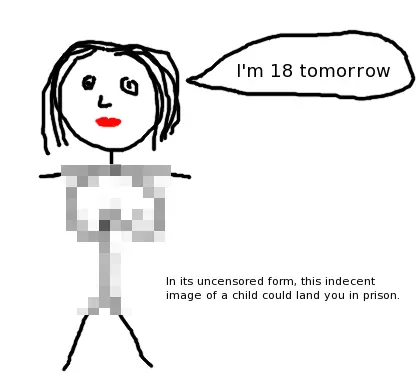

# Why I won’t be joining the Pirate Party UK

When I discovered The Pirate Party UK a couple of months ago, I thought it was
going to be exciting and revolutionary new party for the people of the Internet.
I completely agree with their goals, to drastically shorten the term of
copyright, add fair use clauses to UK copyright law for personal copying, reform
the patent system, abolish Crown Copyright, put an end to the evergreening of
medical patents, prevent excessive monitoring and surveillance by companies and
government and to promote freedom of speech and expression.

However, it turns out they’re just like the other parties. Here’s why I won’t be
joining the PPUK any time soon:

After a Telegraph blogger made a reference to some childish remarks posted about
Peter Mandelson which could be criticised as homophobic, PPUK’s leader Andrew
Robertson performed a typical knee-jerk-reaction and posted an article stating
that [homophobia will not be tolerated in (the) party](https://web.archive.org/web/20091207064353/http://www.pirateparty.org.uk/blog/2009/aug/18/homophobia-will-not-be-tolerated-party/).
This upset me, if I want to poke fun at Mandy for being gay then that’s my
business, fascists. I can understand that the higher echelons of the party
should be held to standards of political correctness, but to force ordinary
members to adhere to standards of political correctness *while not representing
the party*, when freedom of speech is a core value of the party, just stinks of
hypocrisy. Whatever happened to *I disapprove of what you say, but I will defend
to the death your right to say it*?

Another freedom of speech issue is that prominent members
[support the Obscene Publications Act](https://web.archive.org/web/20091207064353/http://www.pirateparty.org.uk/blog/2009/aug/19/pirate-party-claims-using-common-sense-under-inves/) and the new ban on
cartoon pornography. If perverts want to write stories of sexual mutilation and
murder, even if they include sex acts on babies, then this should be none of my
business. I’d like to draw a lesbian stick-girl orgy set in a college, but these
oppressive laws prevent me from exercising this freedom.

you'd better clear your cache then, just in case!

Finally, and this is the worst problem with PPUK, they have
[removed all political discussion from the public section of the forums](https://web.archive.org/web/20091207064353/http://www.pirateparty.org.uk/forum/viewtopic.php?f=11&t=655),
which means you have to pay your membership fee to express an opinion on
policies. This is a step too far, it is a thinly disguised money grabbing policy
which only alienates the public and stifles political debate. So much for a new,
revolutionary, Internet based party for the people.

I seriously hope that someone forms a new and inclusive party, which actually
practices the policies it preaches. Until that time I guess I’ll be voting
Liberal Democrats.
