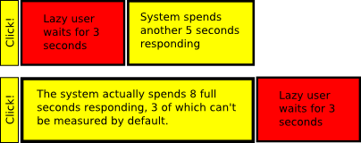

# Citrix of the Trade

I've been using LoadRunner for Citrix for about a week now, it's a new protocol
for me and I guess I'm starting to get the hang of it because I've created a
list of tips and tricks to share with the Internet.

I'm assuming you've read the other guides, about using the keyboard where
possible, making sure your colour settings and screen sizes are the same on each
injector, using bitmap and text checks for synchronization, clicking on menus
because mouse movements don't work and so on.

## Don't trust LoadRunner to get your transactions right

As of version 9.5, LoadRunner records Citrix scripts which look like this:

```c
lr_start_transaction("Receive bacon");
ctrx_sync_window("Bacon dispenser", ACTIVE, 100, 100, 200, 200, etc);
// push button
ctrx_mouse_click( 50, 50, 0, CTRX_LAST);
lr_end_transaction("Receive bacon", LR_AUTO);
 
lr_start_transaction("Enjoy bacon");
ctrx_sync_window("Bacon", ACTIVE, 100, 100, 200, 200, etc);
```

In this case, at recording we put transactions around the time taken to push the
button and get some bacon, not how long it takes to focus the bacon dispenser
and then push the button. A transaction is all about timing something, which
means you do something and then wait for a response; a transaction should never
start with a sync and should almost always end with one. So, we need to edit the
Receive bacon transaction to look something like this:

```c
lr_start_transaction("Receive bacon");
// push button
ctrx_mouse_click(50, 50, 0, CTRX_LAST);
ctrx_sync_window("Bacon", ACTIVE, 100, 100, 200, 200, etc);
lr_end_transaction("Receive bacon", LR_AUTO);
```

## Don't trust LoadRunner to insert think-times of the correct length, nor in the correct places

This one is an even more painful schoolboy error, let's use the
[bacon meme](bacon.jpg) as an example again and a more realistic recording
including recorded thinking time, LR would generate something like this:

```c
lr_start_transaction("Receive bacon");
ctrx_sync_window("Bacon dispenser", ACTIVE, 100, 100, 200, 200, etc);
// push button
ctrx_mouse_click( 50, 50, 0, CTRX_LAST);
lr_think_time(15);
lr_end_transaction("Receive bacon", LR_AUTO);
 
lr_start_transaction("Enjoy bacon");
ctrx_sync_window("Bacon", ACTIVE, 100, 100, 200, 200, etc);
```

Did you spot it? Firstly the think time is incredibly large because LoadRunner's
Citrix client recorder is obscenely slow, so you'll have to adjust the value to
the amount of time the user would actually spend marvelling at their delicious
bacon before eating it. This would be far less than 15 seconds. Let's also apply
the fix from above:

```c
lr_start_transaction("Receive bacon");
// push button
ctrx_mouse_click(50, 50, 0, CTRX_LAST);
lr_think_time(3);
ctrx_sync_window("Bacon", ACTIVE, 100, 100, 200, 200, etc);
lr_end_transaction("Receive bacon", LR_AUTO);
```

Now the glaring error becomes obvious: The think-time and the sync are the wrong
way around! If you don't strip think times from the results, you can only report
on timings of 3 seconds and over. That's just sloppy, but much worse than that,
if you do strip the think time then you'll report timings 3 seconds shorter than
the system actually takes to respond:



Yeah that means that if your scripters don't know what they're doing then you
run the risk of reporting great timings for an abysmally slow system. So SLAs
aren't met, your company receives huge fines, or in the case of the system I'm
working on lives may even be lost.

## Ignore the replay guidelines published by Citrix

Do not replay think-time when debugging scripts, this will force you to write
robust scripts that measure rather than relying on the system response times.
You won't be tempted to resort to extending the think-times to fudge
synchronisation when you get a huge number of users running.

## When you can't trust a bitmap, cheat with events

Sometimes you can't trust a bitmap synchronization because the application has
painted, but is still processing and will not respond to mouse input. Keyboard
input isn't so much of a problem as it will queue up, but mouse events may be
discarded. Thankfully we know that MFC, VB and Java applications are event
driven. This means we can use bitmaps synchronizations on things triggered by
mouse movement and hover events, then do a click after that.

For example, move the mouse back and forth across a toolbar button, wait for a
short period of time (use sleep(), not think time!), then do a check (not a
sync) on the bevel which is drawn around it. The same applies to other
mouse-over events, if it can take a mouse-over it can probably take a click
event. Unfortunately LR can't detect mouse cursor changes, which would be a
great tool for this purpose.

Another similar idea is to use the text buffer; input a character or set the
focus with the tab key, then wait for the change in state.

## You can't sync on a context menu

They don't have a name so they get an obscure number at record time, which
cannot be found at playback. Use bitmap checks on the screen area for these
instead. Of course, you should really be using the keyboard where possible, but
this isn't always possible (accessawhatability?)

## The pixel-sync trick

Record a 3×3 pixel bitmap check for white, grey and declare or `#define` them as
functions like so:

```c
#define Sync3x3(x,y,hash) ctrx_sync_on_bitmap(x, y, 3, 3, hash, CTRX_LAST)
#define WHITE(x,y) Sync3x3(x, y, "794f0585be94ed32b0fe3d42f8917eea")
#define GREY(x,y) Sync3x3(x, y, "2e32a138b3fee935c6efabeb24c05733")
#define BLUE(x,y) Sync3x3(x, y, "7c7ebab71cd7ebeab3f0aa710501fa07")
```

Then, providing you've been a good boy and remembered to maximize your window
before recording, you can avoid re-recording when you need a new sync point.
Just insert an object click via the GUI tree-view and replace it with one of the
macros above in the code. Please note, your grey colour may be different to
mine, it's best to record your own pixels. Also don't bother with a 1×1 pixel,
LoadRunner always fails those checks. (I didn't try a 2×2 check)

## Remove those rogue mouse-up events

After drawing the rectangle for a bitmap or text synchronization point, you'll
often get a rogue mouse-up event. Remove those, they're a confusing waste of
processing time and won't happen in the real world.

## Conclusion

The industry standard load testing tool is simple enough for trained monkeys to
use, but its default Citrix settings suck to the point of being dangerous.
Handle with care!

That's all I've learned this week, hopefully it's enough for me me to help
deliver this project on time. Expect more similar rants and tips over the
coming months.
