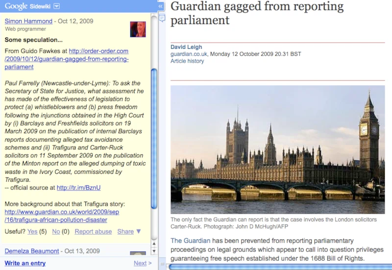

# Trafigura vs The Internet

The news are banging on about how the Internet has won against Trafigura's
attempts to gag the British press from reporting on questions in parliament,
they couldn't stop social media hosted in other countries so the whole thing
blew up in their faces. Great news!

However, far more interesting IMO is metadata provided by Google Sidewiki, which
allows anyone with a Google account to add uncensored discussion to the side of
the page:

All the fuss seems to be about the Minton report, apparently the press aren't
allowed to talk about the content or tell people where to find it, and certainly
not link to it.

FYI it talks about a cocktail of toxic chemicals being dumped on the Ivory Coast
(including ten tonnes of sodium hydroxide), and you can get it from WikiLeaks
[here](https://web.archive.org/web/20091206035852/http://wikileaks.org/wiki/Minton_report:_Trafigura_Toxic_dumping_along_the_Ivory_Coast_broke_EU_regulations,_14_Sep_2006).
