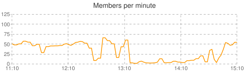

# Interpolated list class for Python

While messing with Python to output some better graphs for my Facebook group
scraper I stumbled upon an interesting problem. What happens if you have missing
samples, or want to change the sampling frequency half way through your log?
Well, you could use a proper math library and have extra dependencies or generate
the missing data manually, but the simplest answer I could think of was to write
a list class which interpolates between missing values, so you can do something
like this:

```python
>>> a = InterpoList()
>>> a[0]   = 0
>>> a[100] = 200
>>> a[200] = 0
>>> a[50]
100.0
>>> a[125]
150.0
```

And then store the time values as seconds past the epoch. Now I can inject data
from multiple sources taken at different frequencies and retrieve an
interpolated value for any time, which means more nice graphs like this:



As usual I also decided to share it with the Internet, because I’m nice like
that! You can get a copy of the InterpoList module
[here](https://web.archive.org/web/20110830082646/http://svn.bitplane.net/misc/trunk/py/InterpoList.py).
