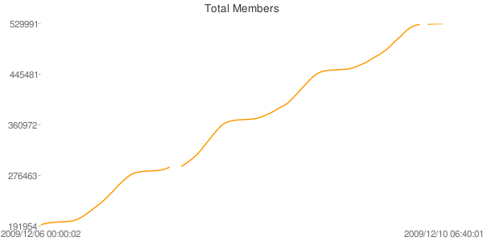
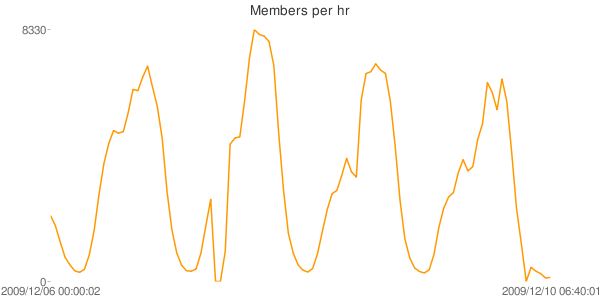

# Chart Against The X Factor

For the last four years running Simon Cowell’s plastic karaoke acts have held
the Christmas #1 spot in the UK singles charts thanks to ITV’s hit show 
[The X Factor](https://web.archive.org/web/20091212093809/http://xfactor.itv.com/).
People have been complaining that this has ruined the great British tradition
of betting on which artist will take the number one slot, as it’s
traditionally the only time of year when the chart is dominated by wacky
Christmas songs rather than the latest boy bands and whoever else thirteen year
old girls spend their pocket money on.

I’m not too bothered about popular music, the singles chart or who gets the
Xmas #1 slot, but last week I was invited to join a growing [group on Facebook](https://web.archive.org/web/20091212093809/http://www.facebook.com/group.php?gid=2228594104)
who are campaigning to knock the X Factor winner from the top spot by mass
purchasing Rage Against The Machine’s classic track [Killing in the Name](https://web.archive.org/web/20091212093809/http://www.youtube.com/watch?v=fkuOAY-S6OY).
The sound of rebellion to conquer the airwaves, political rap metal on
future Christmas compilation albums, all for the princely sum of 79p? I don’t
usually buy digital downloads but this time you can count me in!

According to [Sky News](https://web.archive.org/web/20091212093809/http://news.sky.com/skynews/Home/Showbiz-News/X-Factor-Could-Be-Beaten-To-Christmas-Number-One-By-Anti-Simon-Cowell-Facebook-Campaign/Article/200912115491121)
the group had 43,000 members sometime on Friday, but by the time I got home
on Saturday night there were 180,000 members and rising. As the media coverage
increases so do the new members, which made me interested: how does a
phenomenon like this evolve, how will it turn out next Sunday? What happens
when the UK Charts people decide that it’s against the rules and disqualify
the single?

So I decided to log and graph the group’s membership, every fifteen minutes I
grab the page using wget, I extract the number of users and dump that into a
text file along with the current date and time. Then I cut through it using a
couple of awk and sed one liners, dump the results into an HTML file, graph it
using Google Charts and upload the output to my file dump.





**Update: These graphs are no longer live! Click for the [live versions](https://web.archive.org/web/20091212093809/http://dump.bitplane.net/ratm/index.html)
which are updated much more often using a different script**

Here's the scraping script:

```bash
#!/bin/bash
 
cd /home/gaz/ratm/
 
# get the timestamp
timestamp=`date "+20%y/%m/%d %H:%M:%S"`
 
# get the file
wget --max-redirect 2 -O temp.html http://www.facebook.com/group.php?gid=2228594104 --user-agent="Mozilla/5.0 (X11; U; Linux i686; en-GB; rv:1.9.1.5) Gecko/20091109 Ubuntu/9.10 (karmic) Firefox/3.5.5"
 
# extract user count from the file
usercount=`sed -n -e "s/.* of \(.*\) members.*/\1/p" temp.html`
 
# remove any commas from the string
usercount=${usercount//[,]/}
 
# it must have a length, or it will cause problems when Facebook is having problems!
# in this case, we just give a -1 (not good practice from a stats PoV, but it keeps it simple) 
if [ "${#usercount}" -eq "0" ]
then
    usercount="-1"
fi
 
# remove the temporary file
rm temp.html
 
# write the output in CSV format
echo "$timestamp,$usercount" >> data.dat
 
# next I run the graph generating script
```

And this one (no longer in use) creates the two above charts from the data:

```bash
#!/bin/bash
 
# gets a column from a line of a CSV file. The first index is 1, not 0.
getElement() {
    RESULT=0
    local p=`echo "$1"p`
    RESULT=$(echo $2 | sed 's/,/\n/g' | sed -n $p)
}
 
# get the start and end times
 
getElement 1 "$(tail -1 data.dat)"
end=$RESULT
getElement 1 "$(sed -n '1p' data.dat)"
start=$RESULT
 
# get the current minimum and maximum values
min=$(cat minval)
max=$(cat maxval)
 
# get the last value
getElement 2 "$(tail -1 data.dat)"
lastval=$RESULT
 
# set new max value
 
if [ "$lastval" -gt "$max" ]
then
    echo "$lastval" > maxval
    maxval=$lastval
    echo New maximum, $lastval
fi
 
# and the new min value
 
if [ "$lastval" -gt 0 ]
then
    if [ "$lastval" -lt "$min" ]
    then
        echo "$lastval" > minval
        min=$lastval
    fi
fi
 
# get values for the Y axis
quart=$((($max - $min) / 4))
q1=$(($min + $quart * 1))
q2=$(($min + $quart * 2))
q3=$(($min + $quart * 3))
 
# extract the data using regexp:
# 1. get every 4th line of the file, meaning hourly
# 2. take all the values from the file
# 3. remove the trailing comma
 
data=$(awk 'NR%4==0' data.dat | sed -n -e "s/.*,\([0-9]*\)/\1/p" | tr "\n" "," | sed -e "s/\(.*\),/\1/")
 
# build the URL to the total members chart
total_members="http://chart.apis.google.com/chart?chtt=Total+Members&chs=600x300&cht=ls&chxt=x,y&chxl=0:|$start|$end|1:|$min|$q1|$q2|$q3|$max&chds=$min,$max&chd=t:$data"
 
# now let's do members per hour
 
lastval=$min
min=0
max=0
data=""
inputList=$(awk 'NR%4==0' data.dat | sed -n -e "s/.*,\([0-9]*\)/\1/p")
while read line; do
    if [ "$line" -gt "0" ]
    then 
        val=$(($line - $lastval))
        lastval=$line
    else
        val=0
    fi
 
    if [ "$val" -gt "$max" ]
    then
        max=$val
    fi
 
    data="$data,$val"
done <<< "$inputList"
 
# remove comma prefix
data=$(echo "$data" | sed -e "s/,\(.*\)/\1/g")
 
# build the per hour chart
members_per_hr="http://chart.apis.google.com/chart?chtt=Members+per+hr&chs=600x300&cht=ls&chxt=x,y&chxl=0:|$start|$end|1:|$min|$max&chds=$min,$max&chd=t:$data"
 
# I then create an HTML file from some templates and upload everything to my dump
```

## Update

We did it!


